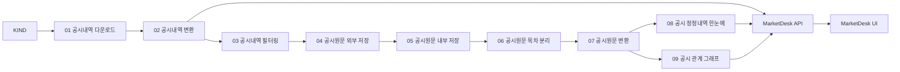

# FINIQ 아키텍처

## 시스템 경계

FINIQ는 공시 수집·구조화, 분석 API와 웹 화면을 한 저장소에서 관리한다.

| 영역 | 책임 |
| --- | --- |
| `finiq.data_scraper` | KIND 공시 목록과 원문을 내려받고 기본 구조를 만든다. |
| `finiq.market_desk.web` | 공시 작업 API와 비동기 실행 상태를 제공한다. |
| `finiq.market_desk.analytics` | 공시, 가격, 그래프 분석을 수행한다. |
| `frontend/finiq_GUI` | MarketDesk와 Graph Viewer 화면을 제공한다. |

## 공시 데이터 흐름

단계별 계약과 저장 형식은 [공시 파이프라인](disclosures/index.md)에서 확인한다.

## 저장 모델

공시 작업은 사용자가 고른 작업공간을 기준으로 `01-list`부터 `09-disclosure-graph`까지 단계별 결과를 저장한다. 각 단계는 완성한 결과만 정상 위치에 게시한다. 작업공간과 단계 연결의 세부 규칙은 [공시 처리 공통 계약](disclosures/common.md)이 기준이다.

로컬 생성 자료는 `resources/` 또는 사용자가 지정한 작업공간에 두며 Git에 포함하지 않는다. 코드, 테스트, 문서만 저장소에서 함께 관리한다.

## 변경 경계

단계·공통 계약과 ADR의 구분은 [개발 안내](development.md), UI 문구와 화면 구성은 [디자인 시스템](design/index.md)을 따른다.
