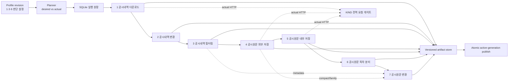

# 공시 1–7 자동화·증분 이어받기 설계

- 상태: Proposed
- 작성일: 2026-07-11
- 대상 브랜치: `codex/disclosure-incremental-workflow-design`
- 범위: 설계와 구현 순서 정의. 이 문서 자체는 런타임 동작을 바꾸지 않는다.

## 1. 결론

새 기능은 기존 7개 작업을 하나의 거대한 함수로 합치지 않는다. 기존 작업은
개별 실행 화면과 구현을 유지하고, 그 위에 다음 세 요소를 추가한다.

1. 1·3·6번 판단 설정을 versioned profile로 저장하는 오케스트레이터
2. run, stage, entity, artifact 상태를 SQLite에 보존하는 영속 실행 원장
3. 실제 HTTP 요청을 모두 합산하는 KIND 전역 요청 게이트

증분 처리의 기본 단위는 페이지가 아니라 `acpt_no`다. 페이지 번호는 한 번의
crawl epoch 안에서만 유효한 전송 위치이며, 장기 checkpoint나 record identity로
사용하지 않는다.

KIND가 검색 snapshot token이나 cursor를 제공하지 않는 현재 계약에서는 시간이
지난 뒤 “기존 page N 다음부터 정확하게 이어받기”를 보장할 수 없다. 신규 공시가
내림차순 결과의 앞에 삽입되면 모든 후속 페이지 경계가 이동하기 때문이다. 따라서
본 설계는 다음 동작을 택한다.

- normal add/no-change sync에서는 완료된 과거 전체를 다시 받지 않는다.
- 검색 기간을 작은 날짜 window로 나눠 완료 상태를 따로 저장한다.
- 중단된 window만 page 1부터 새 epoch로 다시 받는다.
- 최근 window는 매 sync, 봉인된 과거 window는 정해진 audit 기한에 순환 재검사한다.
- 완료된 epoch를 `acpt_no` 기준으로 이전 membership과 비교한다.
- 같은 `row_hash`인 기존 record는 2–7번에서 다시 처리하지 않는다.

즉 네트워크상 작은 window를 재생할 수는 있지만, 전체 기간과 전체 downstream을
처음부터 다시 실행하지는 않는다. 이것이 snapshot 없는 page-number API에서
정합성과 이어받기를 함께 만족시키는 기본안이다.

예외적으로 단일 window의 negative delta를 다른 날짜로의 이동과 구분할 수 없거나
검색 policy 자체가 바뀌면 Stage 1 전체 desired coverage reconcile이 필요할 수 있다.
이때도 검증된 downstream per-entity artifact는 hash가 같으면 재사용한다.

## 2. 확정 설계 결정

| 항목 | 결정 |
| --- | --- |
| 오케스트레이터 위치 | FastAPI backend를 source of truth로 사용한다. UI와 향후 CLI는 같은 service를 호출한다. |
| 기존 7개 화면 | 유지한다. 개별 실행, 설정 편집, 문제 조사 용도로 계속 사용한다. |
| 통합 화면 | 별도 `공시 자동화` 화면을 추가한다. 기존 화면을 한 컴포넌트로 합치지 않는다. |
| 사용자 판단 설정 | 1번 검색 범위, 3번 선택 조건, 6번 목차 규칙만 필수 판단 설정으로 둔다. |
| 기술 실행 설정 | 경로, worker, parser mapping, retry, 분할저장은 profile의 system 설정과 기본값으로 둔다. |
| 단계 토글 | 1–7 각각 `enabled`를 가진다. 비활성 선행 단계의 검증된 산출물이 없으면 후행 단계는 명시적으로 blocked 된다. |
| canonical identity | KIND record는 `acpt_no` 단독을 primary key로 사용한다. 문자열 그대로 보존한다. |
| `doc_no` | viewer 문서 선택과 내부 HTML revision에만 사용한다. |
| `rcept_no` | 생성하지 않는다. |
| 저장 기본 | 자동화 profile에서 4·5·6 산출물은 `분할저장=true`를 기본으로 한다. 기존 저수준 API 기본값은 호환성을 위해 즉시 바꾸지 않는다. |
| 6번 산출물 | 선택된 목차를 이어 붙인 공시별 HTML 1개를 원본과 같은 연도 상대 경로에 쓴다. TOC별 폴더를 만들지 않는다. |
| 7번 필터 | 자동화에서는 비운다. 판단 필터는 3번으로, 목차 판단은 6번으로 모은다. parser mode는 기술 routing 설정이다. |
| 미등록 목차 조합 | 기본 `needs_review`다. 현재처럼 모든 목차를 조용히 저장하지 않는다. |
| KIND 예산 | 기본 80 actual requests/rolling 60s, 설정 가능한 hard maximum 90, burst 1로 둔다. |
| 신규 데이터 감지 | KIND에는 push가 없으므로 사용자의 `동기화` 실행이 기본 trigger다. 주기 실행은 같은 API를 호출하는 별도 후속 기능이며 v1 필수 범위가 아니다. |
| 과거 검색 재감사 | 최근 daily window 외에 90일이 지난 sealed window를 오래된 순서로 순환 audit한다. 미감사 기한을 넘기면 완전하다고 표시하지 않는다. |
| correction family 범위 | profile의 전체 Stage 1 universe 안에서 family를 완성한다. Stage 3 비선택 정정공시도 Stage 4 compact dependency로 수집하되 Stage 5–7 사용자 결과에는 넣지 않는다. |
| 실행 의미 | at-least-once 실행 + idempotent commit을 사용한다. exactly-once 실행을 주장하지 않는다. |
| publish | 부분 결과는 cache에 남기되, 모든 필수 gate가 통과한 generation만 active pointer로 publish한다. |
| 삭제 | filter에서 빠진 raw/HTML cache를 자동 삭제하지 않는다. active membership에서만 제외한다. 정리는 별도 명시 작업이다. |

## 3. 현재 구현에서 확인한 문제

### 3.1 전체 오케스트레이션과 상태

현재 7단계를 묶는 DAG나 dataset revision은 없다. 일반 HTML/table 작업은
`src/finiq/market_desk/web/app.py:131-179`의 handler map과
`src/finiq/market_desk/web/jobs.py:12-115`의 메모리 job manager로 실행한다.
다운로드는 별도 메모리 registry를 사용한다. 서버를 재시작하면 job 상태를 복원할
수 없고, 단계 사이에는 공통 config hash, lineage, artifact validation 계약이 없다.

### 3.2 1번 이어받기

KIND 검색은 `orderStat=D`로 내림차순이다
(`src/finiq/data_scraper/core/payload.py:35-40`). 현재 resume은 로컬에서 확인한
`downloaded_pages + 1`을 다음 page로 정하고 과거 page가 기록한 `total_pages`까지만
받는다(`src/finiq/market_desk/web/features/downloads/kind_runner.py:489-559`).
완료된 로컬 폴더에 신규 공시가 앞쪽으로 들어오면 page 경계가 밀리지만, 코드는
이를 다시 확인하지 않는다.

`kind_workflow.checkpoint.json`도 resume 입력으로 load되지 않는다. 매 실행에서
초기화한 뒤 진행 기록만 쓴다
(`src/finiq/data_scraper/workflow/workflow.py:1196-1215,1591-1625,1655-1662`).

페이지 무결성 검사는 page 번호, 행 수, `total_items`, `total_pages` 일치만 확인한다
(`src/finiq/data_scraper/workflow/workflow.py:1335-1411`). page 경계에서 한 record가
중복되고 다른 한 record가 누락되어도 총 행 수가 같으면 통과할 수 있다.

### 3.3 2·3·6·7번 전량 처리

- 2번은 raw/classification 전체를 읽어 모든 연도 SQLite shard를 다시 쓴다
  (`src/finiq/market_desk/web/features/disclosures/table_export.py:694-789`).
- 3번은 source record 전체를 다시 순회하고 전체 결과를 정렬한다
  (`src/finiq/market_desk/web/features/market_data/service_payloads.py:61-220`).
- 6번은 모든 input HTML을 다시 split하고 output을 overwrite한다
  (`src/finiq/market_desk/web/features/disclosures/html_sections.py:806-925`).
- 7번은 디렉터리의 모든 HTML을 다시 parse하고 하나의 JSON을 overwrite한다
  (`src/finiq/market_desk/web/features/disclosures/html_parse_common.py:572-624,1175-1206`).

6번 규칙은 exact section signature에 매칭되지 않으면 모든 목차를 저장한다
(`html_sections.py:861-867`). 새 조합에 판단이 필요한 자동화 요구와 반대다.

### 3.4 4·5번의 존재 기반 skip

4·5번은 output path가 존재하는지만 확인해 기존 HTML을 정상으로 간주한다
(`src/finiq/market_desk/web/features/disclosures/html_common.py:376-465`). source hash,
`selected_main_doc_no`, content validation, stage config version을 비교하지 않는다.
대상 목록이 줄면 과거 cache 파일을 unexpected file로 보고 이어받기 자체를 거부할
수도 있다(`html_common.py:438-460`).

5번 internal HTML은 한 target마다 `searchContents`와 실제 body URL에 각각 GET을
보내 실제 요청이 2회다
(`src/finiq/market_desk/web/features/disclosures/html_content_download.py:7-31`).
현재 limiter는 target 시작 간격만 제한하므로 90 target/min 설정은 약 180 actual
requests/min이 될 수 있다.

### 3.5 부분 결과와 원자성

raw page, content HTML, compact JSON, parse JSON, HTML manifest의 여러 write가 최종
경로에 직접 수행된다. 취소나 프로세스 종료 시 이전의 정상 결과를 부분 파일이
대체할 수 있다. 또한 다음 상황이 함수 반환상 성공일 수 있다.

- 4번 `saved_count < requested_count`
- 6번 skipped file이 있지만 `integrity_ok=true`
- 7번 `skip_errors=true`로 error record를 남긴 상태

오케스트레이터는 함수가 반환했다는 사실이 아니라 단계별 완료 invariant를
검증한 뒤에만 성공으로 commit해야 한다.

## 4. 목표와 비목표

### 4.1 목표

1. 1–7을 각각 켜고 끄며 개별 실행할 수 있다.
2. 1·3·6 판단 설정을 저장하면 1–7을 자동으로 계획하고 실행할 수 있다.
3. 새 record가 추가되면 동일한 기존 record의 local 변환과 HTML parse를 반복하지 않는다.
4. 중단 뒤 재실행하면 이미 검증·commit한 entity 결과를 재사용한다.
5. stage 설정이나 구현 version이 바뀌었을 때 필요한 범위만 정확히 invalidation한다.
6. KIND에 보내는 모든 actual HTTP request를 하나의 안전 예산으로 제한한다.
7. 어떤 설정과 source로 어떤 artifact가 만들어졌는지 재현할 수 있다.
8. 새 목차 조합처럼 판단이 필요한 데이터는 조용히 포함/제외하지 않는다.
9. 과거 구간과 remote viewer의 freshness가 보장되지 않는 상태를 성공처럼 숨기지 않는다.

### 4.2 비목표

- 분산 worker cluster나 외부 message broker를 도입하지 않는다.
- 현재 7개 상세 화면을 제거하거나 한 번에 재작성하지 않는다.
- KIND 외에 DART identifier를 추정하지 않는다.
- parser field 추출 규칙 자체를 이 작업에서 변경하지 않는다.
- raw/cache artifact를 자동 garbage collection하지 않는다.
- snapshot token 없는 KIND API에 대해 zero-replay page resume을 보장하지 않는다.
- 데이터 추가 감지를 위해 KIND에 전혀 요청하지 않는다고 약속하지 않는다. 변경이
  없는 sync도 최근 mutable window와 audit 기한이 지난 sealed window를 확인하는
  제한된 검색 요청은 필요하다.
- KIND push나 scheduler가 이미 있다고 가정하지 않는다. v1은 명시 `동기화`이고,
  OS/application scheduler 연결은 동일한 idempotent run API 위의 후속 범위다.

## 5. 용어와 불변조건

### 5.1 용어

| 용어 | 의미 |
| --- | --- |
| profile | 어떤 공시 universe와 3·6번 판단 규칙을 지속적으로 유지할지 정의한 사용자 단위 |
| profile revision | 한 시점의 immutable config snapshot과 hash |
| run | 한 revision을 desired state로 맞추려는 실행 |
| stage run | 한 run 안의 1–7 중 한 단계 실행 요약 |
| entity | 증분 판정 단위. 대부분 `acpt_no`; 2번은 year partition, 7번 family aggregate도 사용 |
| attempt | entity를 한 번 처리한 기록 |
| artifact | 검증된 파일 또는 DB materialization과 그 SHA-256/lineage |
| crawl window | 하나의 query hash 아래 독립적으로 완료되는 inclusive date range |
| crawl epoch | 한 window를 page 1부터 끝까지 읽은 한 번의 시도 |
| dependency-only entity | 사용자 선택 결과에는 없지만 correction family 정합성에 필요한 지원 record/artifact |
| audit SLA | sealed window 또는 remote artifact가 재검사되어야 하는 최대 경과 기간 |
| active generation | 모든 gate를 통과해 consumer가 읽도록 publish된 dataset revision |

### 5.2 불변조건

1. `acpt_no`는 TEXT primary key이며 숫자 변환, `_` 분리, `rcept_no` 대체를 하지 않는다.
2. 서로 다른 `request_filter_hash`, `window_request_hash`, crawl epoch의 page를 같은
   snapshot으로 섞지 않는다.
3. stage는 검증되지 않은 upstream generation을 읽지 않는다.
4. file 존재만으로 entity를 up-to-date로 판정하지 않는다.
5. 성공 artifact는 `input_fingerprint`와 output SHA-256을 모두 가진다.
6. 취소·실패한 run은 현재 active generation을 교체하지 않는다.
7. cache membership과 현재 선택 membership을 분리한다.
8. unknown section pattern은 명시 정책 없이는 stage 6을 통과하지 않는다.
9. 실제 KIND HTTP call은 종류와 retry 여부에 관계없이 모두 전역 gate를 통과한다.
10. correction family가 변하면 변경 전 closure와 변경 후 closure의 합집합을 다시 enrich한다.
11. 한 profile의 active coverage에서 하나의 `acpt_no`는 정확히 한 leaf window에만 속한다.
12. audit 기한을 넘긴 coverage는 `fresh` 또는 `complete`로 표시하지 않는다.

canonical identity 보존과 network transport eligibility는 다른 계약이다. Stage 1은
non-empty source identifier를 그대로 보존하지만, 현재 Stage 4·5 KIND adapter는 endpoint
계약상 digit-only `acpt_no`/`doc_no`를 요구한다. automation adapter는 ledger identity를
path stem으로 추정하지 않고 endpoint 직전에 이 grammar를 검증한다. 통과하지 않으면
숫자로 coerce하거나 삭제하지 말고 `unsupported_transport_identifier`로 blocked한다.
KIND가 다른 grammar를 지원한다는 fixture가 생기면 transport validator만 version bump와
함께 넓힌다.

## 6. 제안 아키텍처



오케스트레이터는 기존 HTTP endpoint를 내부에서 다시 호출하지 않는다. Python
함수에 대한 stage adapter를 두고 같은 process 안에서 직접 호출한다. 이로써
endpoint payload와 workflow state를 혼합하지 않고, 테스트에서 adapter를 독립적으로
검증할 수 있다.

권장 신규 module 경계는 다음과 같다.

```text
src/finiq/market_desk/web/features/disclosure_workflow/
  models.py             # profile/run/stage status와 config validation
  store.py              # SQLite schema, transaction, profile mutex
  planner.py            # desired/actual diff와 dependency gate
  orchestrator.py       # run lifecycle, cancellation, publish
  fingerprints.py       # canonical JSON과 input hash
  artifacts.py          # .part, validate, fsync, atomic replace
  kind_gateway.py       # 전역 request reservation, retry, cooldown
  stages/
    download.py
    table.py
    filter.py
    external_html.py
    content_html.py
    sections.py
    parse.py
src/finiq/market_desk/web/routers/disclosure_workflows.py
```

처음부터 framework나 generic DAG DSL을 만들지 않는다. stage는 고정된 1–7 enum과
명시 dependency map으로 구현한다. 현재 요구에는 이것이 더 단순하고 검증하기 쉽다.

표면상 1–7은 선형이지만 Stage 7 내부 의존성은 다중 parent다.

- S2는 S1 committed membership을 읽는다.
- S3는 S2 row를 읽는다.
- S4 viewer는 S3 selected membership과 Stage 1 correction 후보를 읽고, S4 compact는
  viewer 구조와 별도 metadata projection을 만든다.
- S5는 S4가 증명한 selected main document를 읽는다.
- S6는 S5 content를 읽는다.
- S7 parse core는 S6만 읽지만 enrichment/materialization은 parse core, S3 metadata,
  S4 compact/family graph를 모두 읽는다.

따라서 Stage 7 fingerprint도 이 parent들을 모두 명시해야 하며, 단순히 직전 stage
하나의 hash만 이어 붙이지 않는다.

## 7. Profile 계약

아래 YAML은 저장 JSON의 의미를 보여주는 예시다. 실제 구현은 Pydantic model과
canonical JSON으로 validation한다.

```yaml
schema_version: 1
profile_id: 2f87f695e54f47b99354466933730919  # backend 발급 UUID lower-hex
name: 사채 공시 자동화

steps:
  s1_download: true
  s2_table: true
  s3_filter: true
  s4_external_html: true
  s5_content_html: true
  s6_sections: true
  s7_parse: true

decisions:
  s1_search:
    start_date: "2020-01-01"
    end_date_policy: today
    company_name: ""
    submitter_name: ""
    market:
      kind_code: ""
      display_label: 전체
    securities:
      kind_code: ""
      display_label: 전체
    disclosure_type_groups: {}  # canonical KIND field/code snapshot
    last_report_only: false
    include_previous_disclosures: true

  s3_selection:
    filter_blocks: []

  s6_sections:
    unmatched_policy: needs_review
    exact_patterns: []
    title_rules: []

execution:
  data_root: "/absolute/user-selected/path"
  partition: year
  routing:
    parser_mode: bond_issuance
  page_size: 100
  discovery:
    initial_window: month
    max_pages_per_window: 20
    mutable_lookback_days: 7
    sealed_window_audit_max_age_days: 90
    max_epoch_attempts_per_run: 3
    max_audit_windows_per_run: 10
  remote_audit:
    viewer_max_age_days: 90
    max_viewer_audits_per_run: 100
    content_policy: event_or_explicit
  workers:
    local: 8
  publish:
    require_all_enabled_stages: true
```

### 7.1 판단 설정과 실행 설정의 경계

- 1번의 날짜·회사·제출인·시장·증권·공시유형은 acquisition 판단이다.
- 3번의 record predicate는 selection 판단이다.
- 6번의 목차 선택은 content 판단이다.
- page size, worker 수, 분할저장은 의미를 바꾸지 않는 실행 설정이다. KIND 전역
  rate와 retry 상한은 profile별 값이 아니라 application system 설정 하나로 관리한다.
- v1 profile은 하나의 Stage 3 selection과 하나의 `parser_mode`만 가진다. 다른
  selection이나 parser mode가 필요하면 profile을 분리한다. multi-stream은 실제
  중복 비용이 확인될 때만 후속 설계한다.
- 7번 `parser_mode`는 selection 판단 hash와 분리된 deterministic routing이다. mode만
  바뀌면 Stage 3 decision과 Stage 6 inspection은 재사용하지만, mode별 mandatory safety
  policy가 달라질 수 있으므로 Stage 6 output eligibility와 Stage 7 core는 다시 계산한다. 7번에서 다시
  record filter를 받지 않는다. 기존 7번의 parsed-field `record_filters`는 Stage 3에서
  평가할 수 없는 값이므로 억지로 이동하지 않고, 필요하면 7번 이후 별도 결과 view로
  materialize한다.

`parser_mode`는 1·3·6 판단 form에 넣지 않는다. profile template가 현재 지원 mode 중
하나를 기술 기본값으로 snapshot하고 backend가 allowlist/version을 validation한다. mapping이
없거나 ambiguous하면 실행 전에 blocked이며 임의 parser fallback을 고르지 않는다.

`condition_presets` 같은 mutable 이름을 profile이 참조하게 하지 않는다. profile
revision에는 실행할 condition snapshot 전체를 복사한다. preset이 나중에 바뀌어도
과거 run 재현성이 깨지지 않아야 한다.

`data_root`는 artifact가 하나라도 commit된 뒤에는 profile 안에서 변경할 수 없는
placement identity로 취급한다. 결과 의미를 바꾸는 semantic hash에는 넣지 않지만,
경로 변경은 기존 파일 검증·복사·hash 재확인·pointer 전환을 수행하는 별도 storage
migration이어야 한다. 단순 설정 변경으로 옛 root의 artifact를 새 root에서 재사용한
것처럼 보이게 하지 않는다.

### 7.2 비증분 검색 옵션

`last_report_only=true`처럼 새 정정공시가 기존 검색 membership을 제거할 수 있는
조건은 append-friendly하지 않다. 안전한 증분 자동화 v1 profile은
`last_report_only=false`를 요구하고 이전 공시 포함을 유지한다. 기존 개별 다운로드
화면은 이 옵션을 계속 지원하지만, 자동화 profile validation은 `true`를 거부한다.

“최종보고서만”은 단순히 Stage 3로 옮긴다고 해결되지 않는다. 정확한 최종 여부는
Stage 4 compact metadata에서 correction family가 완성되어야 알 수 있기 때문이다.
필요하면 Stage 7 이후 family-aware 결과 view로 제공한다. Stage 1에서 꼭 KIND의
`last_report_only` 결과가 필요하다면 전체 범위 reconcile을 전제로 하는 별도
non-incremental mode로 설계해야 하며, 이 문서의 v1 범위에는 넣지 않는다.

## 8. 단계 토글과 실행 계획

토글은 dependency를 무시하는 skip 명령이 아니다. 또한 실행 전 계획과 실행 중 상태를
한 enum에 섞지 않는다.

| `plan_action` | 의미 |
| --- | --- |
| `disabled` | profile의 persistent `steps`에서 사용하지 않는다. |
| `reuse` | 같은 input fingerprint의 검증된 artifact를 재사용한다. |
| `process` | 선행 artifact가 현재 유효하거나 같은 execution mask의 선행 단계에서 생성될 예정이며 새 처리 또는 재처리가 필요하다. |
| `remove` | 새 generation membership에서 제외한다. cache 삭제는 아니다. |
| `review` | 6번 등에서 새 판단이 필요하다. |
| `blocked` | 필요한 선행 artifact가 없거나 stale인데 이번 실행에서 만들 수 없다. |

entity runtime status는 `queued | running | succeeded | failed | cancelled | interrupted`,
run status는 `queued | running | needs_review | completed | completed_with_errors | failed |
cancelled | interrupted`를 사용한다. 예를 들어 과거에 실패한 entity도 새 plan에서는
`process`이고 runtime은 `queued`다.

규칙은 다음과 같다.

1. disabled 선행 stage라도 같은 profile lineage의 current valid artifact가 있으면
   후행 stage가 이를 명시적으로 재사용할 수 있다.
2. artifact가 없거나 fingerprint가 다르면 후행 stage는 blocked다. 다른 폴더를
   암묵적으로 탐색하는 fallback은 두지 않는다.
3. 개별 작업 실행도 같은 planner를 사용한다. 사용자가 6번만 실행해도 5번 input
   generation과 6번 config hash가 먼저 검증된다.
4. `force`는 일반 toggle 의미에 넣지 않는다. 진단용 explicit invalidate action을
   별도로 두고 audit log에 이유를 남긴다.
5. profile의 `steps`가 desired generation의 유일한 단계 토글이다. run은 기본적으로
   enabled 단계 전체를 execution mask로 고정한다.
6. 개별 작업 실행은 immutable `execution_mask`에 일부 단계만 넣는다. mask 밖의
   enabled stage도 desired state 계산에서는 빠지지 않는다. valid하면 `reuse`,
   dirty/missing이면 `blocked(reason=execution_mask)`이고 `execution_allowed=false`다.
   부분 실행에서 만든 cache는 다음 전체 run이 재사용하지만, 그 실행 하나만으로 모든
   enabled gate를 만족하지 않으면 active generation을 publish하지 않는다.

최초 Stage 1 discovery 전에는 후행 stage의 정확한 entity 수를 알 수 없다. preflight는
억지로 0을 표시하지 않고 `counts_known=false`, count `null`, discovery 이후 재계획됨을
반환한다. 같은 run 안에서 Stage 1 commit 뒤 durable entity plan을 확정한다.

## 9. 영속 상태 모델

profile마다 서로 다른 SQLite를 만들지 않는다. `get_default_settings_path()`의 부모인
application data directory 아래에 `disclosure-workflows.sqlite` 하나를 두고 모든
profile catalog, revision, run, stage/entity, crawl state를 저장한다. profile의
`data_root`에는 큰 artifact만 둔다. 그래야 `profile_id`만으로 상태를 찾을 수 있고
서로 다른 artifact root의 run도 한 원장에서 조정할 수 있다.

SQLite는 WAL mode를 사용하고 모든 status transition을 transaction으로 기록한다.
최소 논리 schema는 다음과 같다.

```text
workflow_profiles
  profile_id PK
  name
  data_root                 # first artifact 뒤 immutable; 변경은 storage migration
  head_revision_id          # 현재 편집/실행할 desired config
  active_generation_id
  generation_version
  created_at, updated_at

workflow_revisions
  revision_id PK
  profile_id FK
  schema_version
  config_json
  config_hash
  created_at
  UNIQUE(profile_id, config_hash)

workflow_plans
  plan_id PK
  profile_id, revision_id
  base_generation_id
  execution_mask_json
  search_snapshot_json
  plan_hash
  created_at, expires_at

workflow_runs
  run_id PK
  profile_id FK
  revision_id FK
  request_id
  resume_of_run_id
  review_of_run_id
  trigger                 # manual | scheduled | resume | review | diagnostic
  execution_mask_json     # run 생성 시 immutable
  status                  # queued | running | interrupted | needs_review |
                          # completed | completed_with_errors | failed | cancelled
  requested_at, started_at, finished_at
  cancel_requested_at
  base_generation_id
  candidate_generation_id
  UNIQUE(profile_id, request_id)

run_search_snapshots
  run_id PK
  effective_at
  resolved_start_date, resolved_end_date
  page_size, request_schema_version
  canonical_request_json
  request_filter_hash
  coverage_policy_hash

stage_runs
  run_id, stage_no PK
  status
  planned_items, reused_items, succeeded_items
  excluded_items, review_items, failed_items
  started_at, finished_at
  error_summary_json

run_stage_entities
  run_id, stage_no, entity_scope, entity_key PK
  plan_action             # disabled | reuse | process | remove | review | blocked
  execution_allowed
  input_fingerprint
  status                  # queued | running | succeeded | failed |
                          # cancelled | interrupted
  artifact_id
  attempt_count
  reason_code, error_message

stage_entities
  profile_id, stage_no, entity_scope, entity_key PK
  input_fingerprint
  output_fingerprint
  artifact_id
  status
  last_success_run_id
  attempt_count
  error_code, error_message
  updated_at

stage_attempts
  run_id, stage_no, entity_scope, entity_key, attempt_no PK
  status
  input_fingerprint
  started_at, finished_at
  error_code, error_message

artifacts
  artifact_id PK
  profile_id
  stage_no
  entity_scope
  entity_key
  input_fingerprint
  request_identity_hash    # network scope only
  source_observation_id    # network scope only
  implementation_version
  semantic_config_hash
  path
  size
  sha256
  validation_status
  created_by_run_id
  created_at

remote_observations
  observation_id PK
  profile_id
  entity_scope, entity_key
  request_identity_hash
  response_sha256
  http_status, final_url
  checked_at
  validation_status

artifact_dependencies
  artifact_id, upstream_artifact_id PK

generations
  generation_id PK
  profile_id
  revision_id
  coverage_generation_id
  manifest_path
  manifest_sha256
  status                  # candidate | active | rejected | superseded
  status_reason
  freshness_json
  created_at, published_at

generation_artifacts
  generation_id, stage_no, entity_scope, entity_key PK
  artifact_id
  desired_membership      # included | excluded | dependency_only
  ordinal

schema_migrations
  version PK
  applied_at
```

`run_stage_entities`가 planner의 durable diff다. Stage 1 commit 뒤 process가 종료되어도
다음 stage의 `reuse/process/remove/review` 계획을 DB에서 복원할 수 있다.
`stage_attempts`는 retry 원인을 남기는 audit 구조다. v1은 process 안의 single executor와
DB-backed profile mutex, `run_stage_entities.attempt_count`로 시작한다. entity lease와
heartbeat는 여러 worker process가 실제로 필요해질 때 추가하고, 미리 분산 queue를
구현하지 않는다.

`workflow_profiles.active_generation_id`와 `generation_version`을 compare-and-swap하는
DB transaction이 publish의 유일한 source of truth다. CAS는 active generation이 run의
`base_generation_id`와 같고, profile `head_revision_id`가 run revision과 같으며, candidate의
coverage/manifest gate가 모두 valid일 때만 성공한다. 실행 중 설정이 바뀐 구 revision
candidate는 `superseded`로 cache만 남긴다. `active-generation.json`은 기존
도구를 위한 derived pointer일 뿐 correctness-critical reader가 사용하지 않는다.
DB commit 뒤 JSON 갱신 전에 종료되면 다음 시작 시 DB에서 JSON을 재생성한다.
file을 만들고 DB commit 전에 종료되면 그 file/generation은 orphan candidate로 남아
active reader에 보이지 않는다.

`head_revision_id`는 현재 편집·다음 실행 대상 config다. 새 review decision으로 head가
앞서가도 이전 active generation은 유지될 수 있다. 실제 게시된 config revision은
`active_generation_id -> generations.revision_id`로만 판단하고 UI에서 “현재 설정”과
“게시된 설정”을 구분한다.

deterministic local artifact는 `(profile, stage, scope, entity, input_fingerprint)`를
unique하게 만든다. viewer/content처럼 같은 request identity의 remote body가 나중에
바뀔 수 있는 scope는 이를 강제하지 않는다. network blob은
`(profile_id, request_identity_hash, response_sha256)`로 immutable하게 보관하고 각 fetch/audit을
`remote_observations`에 남긴다. 동일 SHA가 다시 오면 기존 blob을 재사용하고 checked-at
observation만 추가하며, 다른 SHA면 새 blob과 downstream fingerprint를 만든다.

Stage 1 전용 schema는 page와 canonical record를 분리한다.

```text
crawl_windows
  window_id PK
  request_filter_hash
  start_date, end_date
  parent_window_id
  latest_interpretation_id
  last_audited_at
  status                    # shared capture hint, coverage authority 아님

coverage_generations
  coverage_generation_id PK
  request_filter_hash
  coverage_policy_hash
  resolved_start_date, resolved_end_date
  created_by_run_id
  status

coverage_generation_windows
  coverage_generation_id, window_id PK
  interpretation_id
  mutable_at_snapshot
  next_audit_due_at
  ordinal

crawl_epochs
  epoch_id PK
  window_id
  window_request_hash
  status                  # running | captured | rejected | cancelled
  total_items, total_pages
  opening_page1_blob_path, opening_page1_sha256
  closing_page1_blob_path, closing_page1_sha256
  started_at, captured_at

crawl_epoch_interpretations
  interpretation_id PK
  epoch_id
  row_parser_version
  row_schema_version
  status                  # validating | committed | rejected
  opening_page1_row_hash
  closing_page1_row_hash
  record_set_hash
  interpreted_at, committed_at
  UNIQUE(epoch_id, row_parser_version, row_schema_version)

crawl_pages
  epoch_id, page_no PK
  blob_path
  sha256
  ordered_semantic_row_hash
  total_items, total_pages, row_count

disclosures
  acpt_no TEXT PK
  first_seen_interpretation_id
  last_seen_interpretation_id

disclosure_revisions
  revision_id PK
  acpt_no
  semantic_row_hash
  row_schema_version
  canonical_row_json
  canonical_row_sha256
  first_seen_interpretation_id
  last_seen_interpretation_id
  UNIQUE(acpt_no, row_schema_version, canonical_row_sha256)

disclosure_observations
  interpretation_id, acpt_no PK
  revision_id
  page_no, row_no
  source_blob_path
  observed_at

discovery_memberships
  interpretation_id, acpt_no PK
  revision_id
  semantic_row_hash
  FK(revision_id) -> disclosure_revisions
```

`discovery_memberships`는 interpretation별 immutable set이다. 후속 audit가 같은 window의
새 interpretation을 만들더라도 과거 generation 의미가 변하지 않는다. 각
`coverage_generation_windows` row가 exact interpretation을 pin하며,
`crawl_windows.latest_interpretation_id`는 다음 plan을 위한 cache hint일 뿐이며 current
`window_request_hash` 일치를 다시 검증해야 한다. 과거 consumer가 따라가면 안 된다. run의 모든 planned window가 commit된 뒤에만 exact
interpretation set을 새 coverage generation으로 한 transaction에서 activate한다.

`crawl_windows`는 같은 request filter/date를 쓰는 profile들이 공유할 수 있으므로
`mutable`/`retired` 같은 profile-specific lifecycle을 authoritative하게 저장하지 않는다.
mutability, audit due, parent 대신 child leaf를 쓸지는 frozen coverage policy마다 계산하고
`coverage_generation_windows`에 pin한다. 한 profile의 lookback/split policy가 다른
profile의 shared window를 seal/retire할 수 없다.

row revision도 parser schema별 immutable record다. 새 parser가 같은 semantic fields를
내더라도 과거 `row_schema_version`/canonical JSON을 overwrite하지 않는다. observation과
membership이 exact `revision_id`를 pin하고, downstream delta 비교에만
`semantic_row_hash`를 사용한다.

3번과 6번의 판단 trace를 별도로 보존한다.

```text
selection_decisions
  decision_id PK
  selection_config_hash
  acpt_no
  source_row_hash
  matched
  matched_rule_ids_json
  UNIQUE(selection_config_hash, acpt_no, source_row_hash)

section_patterns
  pattern_hash PK
  sections_json
  first_seen_acpt_no

section_decisions
  section_config_hash, pattern_hash PK
  selected_toc_ids_json
  decision_source         # exact_pattern | title_rule | explicit_default
  created_by_run_id

review_queue
  review_id PK
  profile_id, origin_run_id, revision_id, stage_no
  entity_key, pattern_hash, reason_code
  payload_json
  status
  created_at, resolved_at
  resolved_by_run_id

family_edges
  family_graph_hash, source_acpt_no, referenced_doc_no PK
  profile_id
  target_acpt_no
  source_compact_artifact_id
  resolution_status       # resolved | unresolved_reference | missing_in_scope |
                          # out_of_scope | conflicting

family_graph_revisions
  family_graph_hash PK
  profile_id
  coverage_generation_id
  algorithm_version
  evidence_set_hash
  edge_set_hash
  created_by_run_id

family_memberships
  family_graph_hash, family_id, acpt_no PK
  doc_no, title, disclosed_at, is_correction_report
  sequence_no, member_count
  desired_membership      # included | dependency_only
```

`family_graph_hash`는 profile id, pinned coverage generation, resolver algorithm version,
정렬된 compact evidence artifact hash, resolved/unresolved edge 전체를 canonicalize해
계산한다. `family_edges`와 `family_memberships`는 이 immutable graph revision에 속하므로
후속 correction/audit가 과거 active generation의 family evidence를 바꾸지 않는다.

`entity_scope`는 한 stage 안의 서로 다른 artifact 의미를 분리한다. 예를 들어
`s4.viewer`, `s4.compact`, `s6.inspection`, `s6.output`, `s7.core:<mode>`,
`s7.enrichment:<mode>`를 쓴다.
`entity_key`는 scope 안의 key를 canonical string으로 encode한다. Stage 2는 year,
Stage 3–6은 대부분 `acpt_no`, Stage 7 core는 `acpt_no`, family aggregate는 sorted
member-set fingerprint를 쓴다. 같은 `acpt_no`의 viewer network artifact와 compact
metadata가 한 entity state를 덮어쓰면 안 된다.

raw page body와 row 해석도 분리한다. row parser/schema bug를 고쳐도 같은 request
identity의 검증된 page blob을 local reparse해 새 `crawl_epoch_interpretations`를 만들 수
있어야 한다. request payload/fence 자체가 유효하지 않을 때만 KIND를 다시 호출한다.

## 10. Artifact와 fingerprint 계약

### 10.1 Canonical config hash

hash 입력 JSON은 key 정렬, UTF-8, 고정 separator, 명시적인 null/boolean 규칙으로
serialize한다. UI display label이나 progress 설정처럼 결과 의미를 바꾸지 않는 값은
semantic config hash에서 제외한다. 시장·증권·공시유형은 `전체` 같은 UI label이
아니라 실제 KIND field name/code로 hash한다. 의미상 set인 disclosure code만
정렬·중복 제거하고, 원래 순서가 의미 있는 list는 임의로 sort하지 않는다.

### 10.2 Canonical disclosure row hash

페이지 이동이 unchanged record를 changed로 만들지 않도록 `row_hash`는 semantic field
allowlist로만 계산한다.

포함 field:

- `acpt_no`, `doc_no`
- `company_id`, `company_name`, `market`, `badges`
- `disclosed_at`
- `title`, `title_attr`, `title_base`, `title_display`, `title_flags`
- `is_correction_report`, `has_later_correction`
- `submitter`

제외 field:

- `row_no`
- source file/path/page와 crawl page 위치
- crawl epoch/run id, fetch timestamp, 표시 순서
- raw page bytes와 progress/runtime metadata

text는 parser의 canonical whitespace normalization 결과를 사용하되 casefold하거나
identifier를 숫자로 바꾸지 않는다. list는 field 계약의 순서를 보존한다. source
page/epoch 같은 provenance는 별도 observation row에 저장해 진단 가능하게 하되 semantic
row hash에는 넣지 않는다. row schema version이 바뀌면 명시 migration/rebuild한다.

### 10.3 Entity input fingerprint

기본 식은 다음과 같다.

```text
input_fingerprint = SHA256(
  stage_id
  + entity_scope
  + entity_key
  + ordered upstream artifact hashes
  + semantic stage config hash
  + implementation/schema version
)
```

`ordered upstream artifact hashes`의 순서는 DB 반환/worker 완료 순서가 아니다.
`dependency_role -> entity_scope -> canonical entity_key -> declared ordinal`의 고정
ordering으로 serialize한다. 같은 dependency set이 실행 timing 때문에 다른 fingerprint를
만들면 안 된다.

artifact validity는 membership과 독립적이다. deselect 뒤 reselect한 cache도 재사용할
수 있어야 한다. desired entity의 up-to-date 조건은 모두 만족해야 한다.

1. 최근 성공 entity state의 input fingerprint가 현재와 같다.
2. 참조 artifact가 존재한다.
3. 파일 size와 SHA-256이 ledger와 같다.
4. stage별 structural validation을 통과한다.
5. entity가 현재 desired membership에 속한다.

stage 전체 revision hash를 모든 entity에 그대로 넣으면 국소 규칙 변경도 전량
invalidation한다. 실제 scope별 fingerprint는 다음처럼 더 좁게 만든다.

| Entity scope | Fingerprint 입력 |
| --- | --- |
| `s4.viewer` | request identity = `acpt_no` + Stage 1 `doc_no`/correction refresh evidence + viewer fetch/validation contract; artifact version = response SHA-256/observation |
| `s4.compact-structure` | viewer SHA-256 + compact parser/schema version |
| `s4.metadata-projection` | compact structure hash + 해당 Stage 3 row metadata hash + projection version |
| `s5.content` | request identity = `acpt_no` + selected main `doc_no` + selected-document evidence hash + fetch/validation contract; artifact version = response SHA-256/observation |
| `s6.inspection` | content SHA-256 + splitter implementation version |
| `s6.output` | inspection hash + parser safety-policy version + 그 pattern에 실제 적용된 decision fingerprint + serializer version |
| `s7.core` | section SHA-256 + mode-specific parser-input projection hash + parser mode + parser implementation/schema version |
| `s7.enrichment` | core hash + Stage 3 metadata hash + family graph/compact evidence hash + enrichment version |

S4 compact는 network HTML의 구조 해석과 profile metadata projection을 분리한다. row의
회사명만 바뀌어도 viewer를 다시 요청하거나 공용 structural compact를 오염시키지 않는다.
S5 ledger에는 viewer lineage도 기록하지만, selected-document evidence가 같다면 viewer의
무관한 byte 변경만으로 content를 다시 받지 않는다. remote freshness audit은 semantic
fingerprint와 별도 상태이며, audit에서 실제 body가 바뀌었을 때만 새 artifact가 생긴다.

S6 `decision fingerprint`는 profile 전체 section policy hash가 아니다.

- exact decision이 있으면 `pattern_hash + exact decision`만 사용한다.
- exact가 없으면 그 pattern의 normalized title과 실제로 일치한 title-rule 집합을
  정렬해 사용한다.
- 일치 rule도 없을 때만 explicit unmatched policy를 사용한다.

따라서 exact rule 변경은 그 pattern만, title rule 변경은 exact decision이 없고 해당
title을 가진 pattern만 dirty다. title rules는 순서 의존 precedence 없이 일치 rule들의
결정적 합집합으로 정의해 “하위 규칙 전체” invalidation을 피한다.

S7의 metadata를 모두 enrichment로 취급하지 않는다. mode별 stage contract가 parser에
실제로 주입하는 field를 `parser_input_projection`으로 선언한다. 현재 bond/rights mode는
Stage 4 compact의 normalized title을 유형 판정에 사용하므로 그 title hash가 core
fingerprint에 들어간다. Stage 1 검색 title을 대신 권위 source로 쓰지 않는다.
회사/시장/family처럼 parser 추출 뒤 붙이는 metadata만 enrichment-only다.

S7 core artifact는 현재 parser가 만드는 `index`나 source path처럼 generation 정렬에
따라 달라지는 field를 담지 않는다. 순서/index는 최종 materialization에서 다시 부여한다.
신규 파일 하나가 앞에 정렬돼도 기존 core를 전부 stale로 만들거나 중복 index를 남기지 않는다.

### 10.4 Implementation contract registry

현재 일부 table schema 외에는 splitter/compact/parser의 공통 version registry가 없으므로
문자열 version을 문서에만 적어서는 stale reuse를 막을 수 없다. 신규
`stage_contracts.py`는 모든 entity scope에 다음을 선언한다.

- output schema/policy version
- fingerprint에 들어갈 직접·공유 implementation module 목록
- parser mode별 source bundle과 metadata/family dependency contract

`implementation_hash`는 선언된 module byte hash의 정렬된 bundle + schema/policy version으로
계산해 manifest와 artifact ledger에 저장한다. 선언 module이 없거나 읽히지 않으면 실행을
막는다. 이는 comment-only change도 보수적으로 invalidation할 수 있지만 code change를
놓치는 것보다 안전하다. 공유 helper가 바뀌면 이를 선언한 모든 scope hash가 변한다.

CI characterization test는 1–7 모든 adapter/scope와 지원 parser mode가 registry에 있고,
manifest가 계산된 implementation hash를 담으며, 선언 dependency fixture 변경이 예상 scope
fingerprint를 바꾸는지 검증한다. 수동 version bump만 믿지 않는다.

### 10.5 원자적 write

모든 새 file artifact는 다음 순서를 따른다.

1. 같은 filesystem의 `.part-<uuid>`에 쓴다.
2. flush와 `fsync`를 수행한다.
3. HTML marker, JSON schema, expected identity, row count 등 stage validation을 한다.
4. SHA-256과 size를 계산한다.
5. `os.replace`로 versioned final path에 원자적으로 이동한다.
6. replace 뒤 parent directory도 `fsync`한다.
7. DB transaction으로 artifact와 entity success를 commit한다.

file commit 후 DB commit 전에 죽으면 orphan file만 남고 active state에는 보이지 않는다.
나중의 명시 cleanup이 이를 제거할 수 있다. DB를 먼저 commit해 missing file을
만드는 순서는 사용하지 않는다.

여러 entity를 묶는 manifest는 immutable versioned path에 완성한 뒤, 마지막에
active generation pointer만 transaction/atomic replace한다.

## 11. 파일 배치

자동화 artifact는 stage별로 물리적으로 분리한다. 같은 directory를 여러 stage가
공유해 unexpected/stale file 검사가 충돌하지 않게 한다.

`profile_id`는 사용자가 입력한 이름이 아니라 backend가 만든 UUID lower-hex다.
사용자 표시 이름은 별도 `name` field에 저장한다. 따라서 `/`, `..`, Unicode separator
등이 filesystem 경로에 들어갈 수 없다.

```text
<data_root>/.finiq/workflows/<profile_id>/
  profile-revisions/<revision_id>.json
  runs/<run_id>/run.json
  crawl/
    <request_filter_hash>/<window_id>/<epoch_id>/pages/00001.body
  artifacts/
    02-table/<year>/<partition_fingerprint>.sqlite
    03-filter/<selection_hash>/<year>/<membership_fingerprint>.jsonl
    04-external/<year>/<entity_path_key>/<request_identity_hash>/<response_sha256>.html
    04-compact/<year>/<entity_path_key>/<input_fingerprint>.json
    05-content/<year>/<entity_path_key>/<request_identity_hash>/<response_sha256>.html
    06-sections/<year>/<entity_path_key>/<input_fingerprint>.html
    07-parse-core/<mode>/<year>/<entity_path_key>/<input_fingerprint>.json
    07-results/<generation_id>/parsed-<mode>.json
  generations/<generation_id>/manifest.json
  active-generation.json
```

local derived artifact의 final path에는 input fingerprint를, remote network blob에는
request identity와 response SHA-256을 포함한다. 그래야 새 content가 과거 active
generation이 참조하는 file을 overwrite하지 않는다. generation manifest는
정확한 versioned path를 참조하고, 새 stage adapter는 directory 전체 scan이 아니라
그 manifest의 file 목록을 읽는다. 기존 연도별 flat HTML view가 필요한 경우에만
generation별 compatibility export directory를 명시적으로 materialize한다.

artifact identity는 경로에서 추론하지 않고 ledger가 보유한다. year는 storage
partition일 뿐 primary key가 아니다. year는 valid `disclosed_at`에서 결정한다.
날짜가 없거나 잘못된 record는 `unknown`으로 조용히 추정하지 않고 data-quality
error/review 대상으로 둔다.

source `acpt_no`는 DB와 output field에 한 글자도 바꾸지 않고 보존하지만 filesystem
component로 직접 보간하지 않는다. `entity_path_key = SHA256(UTF-8(acpt_no))` lower-hex를
사용하고 ledger/manifest가 원래 identifier와 매핑한다. empty/NUL/control identifier는
validation error이며 `../` 같은 값이 경로 traversal을 일으킬 수 없다.

generation manifest는 최소한 다음을 가진다.

- schema version, profile/revision/base generation, enabled stages
- stage·entity별 artifact id/path/SHA-256/input fingerprint와 membership
- implementation/config hash, record/error/review count, family graph hash
- recent/cold/viewer freshness status, oldest audit 시각, due/attempted/failed/backlog count
- 이 generation에서 재사용한 artifact와 새로 만든 artifact의 구분

호환 consumer는 고정 parent filename을 추측하지 않고 manifest adapter를 통해 읽는다.
필요한 compatibility materialization은 다음 이름과 schema를 유지한다.

- S2: 기존 연도 SQLite shard + `finiq_disclosure_table_manifest_v1` manifest
- S3: 회사/시장 보강용 `kind_disclosure_filter_v1` JSON
- S4: `compressed-external-html.json` + `finiq_disclosure_external_html_docs_v1` payload
- S5: content manifest와 generation-bound HTML view
- S6: 연도 상대 경로의 공시별 selected-section HTML view
- S7: generation별 `parsed-<mode>.json`

새 adapter가 먼저 ledger/manifest를 읽고, 기존 7개 상세 화면에서 generation을 열 때는
`profile_id`, `generation_id`, `stage`를 명시한다. 자동화 artifact를 현재 global 경로
설정으로 조용히 바꿔 읽지 않는다.

현재 Stage 4 file discovery/compact와 Stage 7 parser/preview는 일부 경로에서 filename
stem을 `acpt_no`로 해석하고 `<acpt_no>.html`을 직접 찾으므로 hashed internal path를
그대로 넘길 수 없다. 자동화 Stage 4 adapter는 directory scan 대신 manifest entity를
넘기고 structural compact parser에 ledger의 `expected_acpt_no`를 명시한다. Stage 7
adapter도 manifest의 `acpt_no`와 artifact path를 metadata/preview 입력으로 전달해
path-stem identity를 분리해야 한다. 기존 개별 API 계약은 유지한다. 이 adapter가 구현되기 전의 임시
compatibility tree는 source identifier가 엄격한 safe filename validation을 통과할 때만
generation 안에 만들 수 있으며, unsafe identifier에 원문을 직접 filename으로 쓰는
fallback은 금지한다.

## 12. Stage 1 — 공시내역 다운로드

### 12.1 Query identity

검색 identity는 세 층으로 나눈다.

`request_filter_hash`는 다음 stable KIND search option을 canonical JSON으로 묶는다.

- 회사명, 제출인, 시장, 증권 구분
- 공시유형 group과 code
- `last_report_only`, `include_previous_disclosures`
- KIND 정렬 mode/direction

`coverage_policy_hash`는 `request_filter_hash`에 profile 시작일, `end_date_policy`,
window/audit policy를 더해 “어느 날짜 범위를 active dataset으로 유지하는가”를 나타낸다.
날짜 범위와 request filter를 분리해야 시작일을 앞당겼을 때 기존 동일 날짜 window를
다시 받지 않고 새 과거 window만 추가할 수 있다.

moving `today`의 실제 날짜와 page size는 두 policy hash에 넣지 않는다. run 시작 시
Asia/Seoul 날짜를 한 번만 읽어 `effective_at`, `resolved_start_date`,
`resolved_end_date`, page size, request schema version을 `run_search_snapshot`에 고정한다.
실행 중 자정이 지나도 bounds를 바꾸지 않는다.

각 실제 request window는 다음으로 별도 `window_request_hash`를 만든다.

```text
window_id = H(request_filter_hash, window_start_date, window_end_date)
window_request_hash = H(
  window_id,
  canonical KIND form fields/codes,
  page_size,
  request_schema_version
)
```

이 구조를 사용하면 `today`가 하루 늘어나거나 시작일을 앞당겨도 기존 동일 날짜 window
identity는 그대로고 새 날짜 window만 추가된다. request filter 또는 window request
hash가 다르면 page namespace를 절대 공유하지 않는다. coverage policy만 다른 run은
겹치는 exact interpretation을 재사용하고 coverage generation만 확장/축소한다. 현재처럼
page size만 확인하고 같은 folder에 다른 filter 결과를 섞을 수 없게 한다.

### 12.2 Window 계획

초기 backfill은 calendar month window로 시작한다. page 1 probe의 `total_pages`가
`max_pages_per_window`보다 크고 window가 하루보다 길면 날짜 범위를 서로 겹치지
않는 `[start, mid]`, `[mid + 1 day, end]` 두 구간으로 결정적으로 나눠 다시 계획한다.
planning probe만 한 parent는 active membership이 되지 않는다. 이미 active parent를
나중에 child로 바꿔야 하는 migration은 새 coverage generation에서 parent interpretation을
빼고 모든 child interpretation을 넣는 한 transaction으로 처리한다. shared window 자체를
retire하지 않는다. 같은 coverage에서 parent와 child가 동시에 active면
안 된다. 하루 window는 더 이상 날짜로 나누지 않고 그대로 완전 수집한다.

지속 sync는 최근 `mutable_lookback_days=7`의 각 날짜를 `[date, date]` 형태의 고정
daily window로 두고 각각 다시 읽는다. rolling 7일 전체를 매일 다른 하나의 window로
만들지 않는다. 그래야 이전 membership이 겹치는 window에 남지 않는다. mutable
horizon보다 과거인 daily window는 해당 coverage policy에서 sealed로 취급되어 recent
sync 대상에서는 빠진다. shared window에 global sealed flag를 쓰지 않는다. 기본
`sealed_window_audit_max_age_days=90`이 지나면 오래된 audit 시각 순서로 다시 수집해
과거 날짜 삽입, 삭제, in-place metadata 변경을 찾는다. 정상 sync plan은 recent daily
window와 기한이 지난 sealed window를 함께 포함하되, 한 run은 oldest-first 기본
`max_audit_windows_per_run=10`까지만 수행한다. 남은 backlog가 있으면 profile freshness를
`overdue`로 표시하고 complete/fresh라고 주장하지 않는다.
initial range도 mutable horizon과 겹치는 부분은 daily window로 계획해 전체 window
집합이 날짜축에서 겹치지 않게 한다.

한 run의 desired coverage는 gap/overlap 없는 ordered leaf window set이다. canonical
active disclosure membership은 `disclosures.active` flag가 아니라 active coverage에
포함된 window membership의 union으로 계산한다.

새 정정공시는 새 접수일의 `acpt_no`로 recent daily window에 들어오며, correction
관계는 downstream에서 다시 계산한다.

7일은 판단 설정이 아니라 운영 기본값이며 profile에서 낮출 수 있다. 데이터 지연
특성을 확인하기 전에는 낮추지 않는 것을 권장한다.

90일 cold-audit 값도 의미 필터가 아니라 요청량과 탐지 지연을 조절하는 기술 기본값이다.
배포 후 실제 변경 빈도와 KIND 예산을 측정해 system/profile validation 범위 안에서
조정한다. 이 기한 안에 한 번 reconcile된 coverage에 대해서만 completeness SLA를
말할 수 있다.

이는 90일에 걸쳐 결국 historical coverage를 한 번씩 다시 검색하는 비용을 뜻한다.
대신 unchanged row는 Stage 2–7로 전파하지 않는다. cold audit을 끄는 경제 모드는
요청량은 줄지만 과거 날짜 insertion/수정을 놓칠 수 있으므로 v1 기본으로 선택하지
않으며, 사용한다면 profile 상태를 `best_effort`로 낮춰야 한다.

예산 때문에 아직 시도하지 못한 overdue window만 있으면 새 generation은 freshness
warning과 audit evidence를 manifest에 남기고 publish할 수 있다. 반면 이번 run에서
시도한 audit가 validation/network failure로 끝났거나 `pending_negative_reconcile`가
남으면 candidate publish를 막는다. viewer audit도 oldest-first 최대 100 entity/run으로
같은 원칙을 적용한다. 두 budget은 배포 후 latency/request량 측정으로 조정하는 기술
기본값이다.

하루 window가 `max_pages_per_window`를 넘는 것은 오류가 아니다. 날짜로 더 나눌 수
없으므로 전체 page를 처리하되 plan에 high-cost window로 표시한다. 한 epoch의 fence
불일치 재시도도 무한 반복하지 않고 system `max_epoch_attempts`에 도달하면 retryable
failed window로 종료한다.

### 12.3 Epoch 수집과 commit

```text
for each planned window:
  create a new crawl epoch
  fetch page 1 under the global KIND gate
  if window should split:
      reject this epoch as planning-only and enqueue child windows
  fetch pages 2..N under the same epoch
  for every page:
      require same total_items and total_pages
      parse rows immediately
      require non-empty acpt_no
      require unique acpt_no inside the epoch
      record page body hash and ordered (acpt_no, semantic_row_hash) hash
  re-fetch page 1 as a closing fence
  require first-page ordered (acpt_no, semantic_row_hash) hash and pagination equal opening
  require every disclosed_at date belongs to this window
  require unique acpt count == total_items
  atomically commit a parser/schema interpretation and its immutable membership
  mark interpretation committed and move latest_interpretation_id hint
after every planned window is committed:
  build a candidate coverage that pins each exact interpretation_id
  enforce one owning leaf window per acpt_no in the candidate coverage
  atomically commit the coverage generation and its profile-level union diff
```

closing fence와 count 검사는 KIND snapshot token을 대체하는 최선의 local 검증이다.
동일 count·동일 첫 page를 유지한 채 middle page 내용만 동시에 바뀌는 상황까지
절대적으로 막을 수는 없다. 그래서 recent daily window와 기한 기반 cold audit으로 다시
reconcile한다. opening/closing raw body는 별도로 보존하고 semantic fence는 고정된 row
parser/schema version으로 해석한다.

한 window가 fence 불일치로 reject되면 같은 run에서 최대
`max_epoch_attempts_per_run=3`까지만 새 epoch를 만든다. HTTP retry 3회와 epoch 재시도
3회는 서로 다른 상한이다. 모두 실패하면 `retryable_window_churn`으로 run을 실패시키고
다음 명시 sync에서 다시 계획한다. 하루짜리 high-cost window는 더 쪼개지 못하므로
전역 gate 아래 끝까지 수집하되, 계속 변해 3 epoch가 reject되면 같은 상태로 멈춘다.

### 12.4 중단과 resume

- 같은 run에서 이미 commit된 window는 다시 받지 않는다. 다음 sync의 recent window나
  audit 기한이 지난 sealed window는 의도적으로 새 epoch로 reconcile한다.
- running/cancelled epoch의 page는 evidence로 남길 수 있지만 canonical membership에
  publish하지 않는다.
- 프로세스 재시작 뒤 incomplete window는 새 epoch로 page 1부터 다시 받는다.
- wall-clock interruption을 넘겨 과거 page 1과 새 page N을 섞는 최적화는 기본으로
  사용하지 않는다.
- 같은 record hash는 upsert diff에서 `unchanged`가 되므로 downstream은 다시 돌지 않는다.

### 12.5 Stage 1 diff

각 window의 local added/removed event를 downstream에 바로 전달하지 않는다. 여러 window
refresh, 날짜 이동, parent→children 교체가 모두 끝난 candidate coverage의 leaf
membership union을 만들고, 이를 이전 profile generation의 union과 비교해 다음 최종
event를 만든다.

- `added_to_membership`: candidate에는 있고 base에는 없는 `acpt_no`
- `changed`: 같은 `acpt_no`의 normalized row hash가 달라짐
- `removed_from_membership`: 이전 committed window에는 있었으나 새 epoch에는 없음
- `unchanged`: identity와 row hash가 동일

`first_seen`은 membership event가 아니라 별도 provenance다. 과거에 제거됐다가 같은
row hash로 다시 나타난 record도 `added_to_membership(first_seen=false)`이며, cached
per-entity artifact는 재사용하되 Stage 2 year membership fingerprint는 dirty가 된다.

같은 epoch 안에서 동일 `acpt_no`가 서로 다른 row로 두 번 나오면 silent dedup하지
않고 fatal integrity error로 epoch를 reject한다. 서로 다른 epoch에서 row가 바뀌면
revision을 기록하고 최신 committed row로 upsert한다.

desired coverage 안에서 같은 `acpt_no`가 둘 이상의 leaf window에 나오면 날짜 field를
근거로 조용히 하나를 고르지 않는다. 같은 revision이 새 `disclosed_at`으로 이동한 것이
명확하면 새 날짜를 포함하는 window로 membership을 원자적으로 이동하고 이전·새 year를
모두 dirty로 만든다. 서로 충돌하는 row가 동시에 관측되면 coverage commit을 reject하고
해당 두 window를 함께 reconcile한다.

`removed_from_membership`은 cache 삭제를 뜻하지 않는다. current view에서 inactive로
표시하고 downstream generation에서 제외한다.

단, 하나의 refreshed window에서 record가 사라졌다는 사실만으로 final removal을
publish하지 않는다. 공시 날짜가 아직 audit하지 않은 다른 window로 이동했을 수 있기
때문이다. 같은 run에서 새 owning window의 positive observation이 있으면 move로 확정할
수 있다. 그렇지 않으면 `pending_negative_reconcile`로 두고 이전 active membership을
유지한 채 profile 전체 desired coverage를 전역 gate 아래 reconcile한다. 전체 union에서도
없을 때만 removal을 commit한다. 향후 KIND의 direct-acpt lookup이 공식 fixture로
검증되면 이를 더 싼 confirmation 경로로 추가할 수 있지만, v1은 존재한다고 가정하지 않는다.

### 12.6 완료 invariant

- 모든 page의 pagination 값이 동일하다.
- page 번호가 1..N으로 정확히 한 번씩 존재한다.
- 모든 row에 valid `acpt_no`가 있다. 여기서 valid는 source가 준 non-empty identifier를
  그대로 안전하게 보존할 수 있다는 뜻이며, 정수 변환이나 `isdigit()` coercion을 뜻하지 않는다.
- epoch 내 `acpt_no`가 유일하다.
- desired active coverage 전체에서도 `acpt_no` owning window가 유일하다.
- unique `acpt_no` count가 `total_items`와 같다.
- 모든 `disclosed_at` 날짜가 요청 window 안에 있다.
- opening/closing page 1 fence가 같다.
- request filter hash, coverage policy hash, window request hash, 실제 request payload가
  run snapshot과 정확히 일치한다.
- recent window와 audit 기한이 지난 sealed window가 모두 committed됐거나 profile이
  명시 `overdue/failed`로 표시된다.

## 13. Stage 2 — 공시내역 변환

Stage 2의 canonical input은 committed Stage 1 membership과 normalized disclosure
row다. incomplete raw folder를 직접 scan하지 않는다.

증분 단위는 year shard다.

1. Stage 1 diff의 `added_to_membership`/changed/removed record에서 영향받은 year를 계산한다. 날짜가
   바뀌면 이전 year와 새 year를 모두 dirty로 만든다.
2. desired coverage union의 year별 ordered `(acpt_no, row_hash)` 목록으로 partition
   fingerprint를 만든다.
3. fingerprint가 같은 year shard는 재사용한다.
4. dirty year만 전체 row를 읽어 temporary SQLite shard를 만든다.
5. row count, unique `acpt_no`, 필수 index, schema version을 검증한다. FTS는 기존
   consumer가 요구할 때만 만드는 optional compatibility index다.
6. versioned shard와 새 manifest를 publish한다.

SQLite에 row별 in-place upsert하는 것보다 dirty year를 atomic rebuild하는 방식을 먼저
선택한다. 연도 단위 local rewrite는 네트워크 비용이 없고, FTS/index와 취소 시
원자성을 단순하게 보장한다. 전체 연도를 모두 다시 만드는 현재 동작보다 충분히
작으며 구현 복잡도도 낮다.

Stage 1 row의 canonical unique key는 `acpt_no` 단독이다. 현재 일부 경로의
`(acpt_no, company_id, disclosed_at, title)` dedup은 사용하지 않는다.

### 완료 invariant

- upstream generation이 committed다.
- 각 active disclosure가 정확히 한 year shard에 있다.
- 각 shard의 `COUNT(*) == manifest disclosures`다.
- 전체 shard unique `acpt_no` 합계가 active Stage 1 membership과 같다.
- manifest가 참조하는 모든 shard hash가 검증된다.

## 14. Stage 3 — 공시내역 필터링

Stage 3은 판단 policy를 record별로 평가한다. 결과를 하나의 일회성 transfer 파일만
만들어 끝내지 않고, decision table과 profile selection membership으로 보존한다.

### 14.1 같은 설정으로 데이터만 추가된 경우

- added/changed Stage 2 record만 평가한다.
- unchanged record의 기존 decision을 재사용한다.
- removed record는 selection membership에서 제외한다.
- selected set diff를 `added/removed/metadata_changed/unchanged`로 downstream에 전달한다.

### 14.2 Stage 3 설정이 바뀐 경우

판단식 자체가 바뀌면 기존 모든 record의 결과가 달라질 수 있으므로 local 전체
재평가는 피할 수 없다. 다만 이는 KIND network나 HTML re-download를 의미하지 않는다.
새 selected set과 이전 selected set의 diff만 4–7번에 전파한다.

### 14.3 Selection과 parser routing

v1의 profile은 selection 하나와 parser mode 하나를 가진다. selection predicate hash와
parser route hash를 별도로 저장해 mode 변경이 Stage 3 전량 재평가를 일으키지 않게 한다.
다른 filter/mode 조합은 별도 profile로 만든다. 여러 stream 사이 network cache 공유를
위한 범용 graph는 v1에 넣지 않는다.

기존 UI/consumer 호환이 필요하면 decision table에서 `kind_disclosure_filter_v1` JSON을
materialize할 수 있다. 이 JSON을 다시 만드는 것은 cheap view build이며 record filter를
다시 수행하거나 network를 호출하는 것이 아니다.

### 완료 invariant

- source record 수와 evaluated/reused decision 수가 일치한다.
- 각 decision은 source row hash와 selection config hash를 가진다.
- selection membership의 `acpt_no`가 canonical disclosure에 모두 존재한다.
- fixed ordering은 materialization 시 결정하며 identity로 사용하지 않는다.

## 15. Stage 4 — 공시원문 외부 저장

Stage 4는 네 내부 substep을 한 사용자 단계로 묶는다.

1. selected record와 correction dependency 후보의 viewer HTML download/cache
2. viewer HTML의 profile-independent structural compact 생성
3. Stage 3 회사/시장/공시일을 붙이는 profile metadata projection
4. compact `mainDoc` evidence의 correction family graph/closure 계산

network artifact entity key는 `acpt_no`다. 기존 artifact를 재사용하려면 ledger hash와
HTML structural validation이 모두 통과해야 한다. path 존재만으로 skip하지 않는다.

structural compact record에는 다음을 보존한다.

- `acpt_no`
- selected main `doc_no`
- `mainDoc`/attached document 목록
- source viewer SHA-256과 size
- compact implementation version

회사/시장/공시일은 별도 metadata projection에 둔다. 동일 viewer 구조를 profile이나
selection metadata가 오염시키지 않고 재사용하기 위해서다.

단일 `compressed-external-html.json`을 매번 처음부터 parse하는 대신 per-acpt compact
record를 cache하고, generation materializer가 year별 collection JSON을 만든다.

### 15.1 Family dependency 수집

family correctness domain은 “Stage 3 selected set”이 아니라 profile의 전체 committed
Stage 1 universe다. 그렇지 않으면 원본 공시는 선택됐지만 새 정정공시는 Stage 3에서
제외된 경우 family가 영원히 오래된 상태가 된다. 따라서 initial run과 delta run에서
Stage 1의 정정 표시(`is_correction_report`, `has_later_correction`)가 있는 모든 신규·변경
record를 `dependency_only` Stage 4 target으로 계획한다. Stage 5 content와 Stage 6·7
사용자 record는 계속 selected membership만 처리한다.

closure는 다음 순서로 반복 확장한다.

1. selected record와 모든 correction 후보의 viewer/compact를 확보한다.
2. compact의 각 `mainDoc.doc_no`를 Stage 1 canonical `doc_no -> acpt_no` index에서 찾는다.
   이 index는 후보 discovery hint일 뿐 family의 최종 근거가 아니다.
3. 후보 record를 `dependency_only`로 viewer/compact하고, 그 compact의 selected main
   `doc_no`가 참조값과 일치하는지 확인한 뒤에만 edge를 확정한다.
4. 새 edge가 없을 때까지 반복하고 persistent `family_edges`에 evidence artifact를 남긴다.

Stage 1 `doc_no` index에 새 일반 record가 추가됐을 때 기존 `unresolved_reference`와
일치하면, Stage 3에서 선택되지 않았고 correction flag가 없어도 그 record를
`dependency_only` Stage 4 target으로 승격해 edge를 다시 검증한다.

family 순서는 완전한 compact의 `mainDoc`를 `(option_index, doc_no)` 오름차순으로 정렬한
값이며 sequence는 0부터 시작한다.
각 `doc_no`는 `selected_main_doc_no`가 같은 compact record 정확히 하나에 매핑되어야 한다.
마지막 `doc_no`에 매핑된 terminal member의 compact 목록을 authoritative list로 삼고,
다른 member evidence와 모순되면 `conflicting`이다. `family_id`는 현재 parser contract대로
그 마지막 member의 `acpt_no`, `current_sequence`는 이 authoritative 순서로 계산한다.
compatibility materialization은 각 member의 기존 `acpt_no`, `doc_no`, `title`,
`disclosed_at`, `is_correction_report`, sequence/member count field를 그대로 유지한다.

새 정정공시가 들어왔을 때 새 closure만 invalidation하면 split/merge/구성원 제거를 놓칠
수 있다. graph 변경은 `old closure ∪ new closure` 전체를 Stage 7 enrichment 대상으로
만든다. 최신 정정 viewer의 `mainDoc` 목록을 우선 evidence로 사용하되 모든 member compact와
상호 모순이 없는지 검사한다. `filtered.json`이나 Stage 1의 doc mapping만으로 final
family metadata를 만들지 않는다.

v1은 `require_complete_within_profile_scope`만 지원한다. local `doc_no` index miss만으로
기간 밖이라고 단정할 수 없으므로 기본 `unresolved_reference`다. 검증된 targeted lookup
또는 더 넓은 trusted canonical catalog가 날짜/identity를 증명할 때만 `out_of_scope`,
scope 안임을 증명했는데 찾지 못하면 `missing_in_scope`다. 충돌은 `conflicting`이다.
selected family와 교차하는 모든 unresolved/error 상태는 candidate publish를 막고,
사용자는 1번 검색 범위를 넓히거나 3번 선택에서 해당 record를 제외해야 한다.
불완전 family를 조용히 단일 record family로 만드는 fallback은 두지 않는다.

Stage 3에서 빠진 `acpt_no`의 viewer cache는 삭제하지 않는다. 새 generation manifest가
이를 사용자 결과로 참조하지 않을 뿐이며, `dependency_only` family evidence로는 참조할
수 있다. 나중에 다시 선택되면 검증 후 재사용한다.

local fingerprint만으로 원격 viewer가 그대로인지 증명할 수는 없다. 신규 correction
event가 생기면 그 family의 최신 viewer를 반드시 refresh하고, 그 외 selected/dependency
viewer는 기본 90일 audit 기한으로 전역 gate 아래 재검사한다. 기한을 넘긴 evidence가
남으면 remote freshness를 `overdue`로 표시한다. ETag가 없는 한 이는 “마지막 audit
시점 이후 변경 없음”을 보장하지 않는다는 한계도 UI에 드러낸다.

### 15.2 완료 invariant

- active selected membership과 필요한 dependency closure마다 valid viewer/compact
  artifact가 정확히 하나 있다.
- HTML 안에서 expected KIND viewer marker와 request lineage를 확인하고, embedded
  `acpt_no`를 추출할 수 있으면 expected 값과 비교한다.
- compact record의 source SHA-256이 viewer artifact와 같다.
- selected family와 교차하는 모든 `mainDoc` edge가 compact evidence로 resolve된다.
- `saved_count == requested_missing_count`; 실패 대상은 entity `failed`다.
- partial success를 stage complete로 승격하지 않는다.

## 16. Stage 5 — 공시원문 내부 저장

Stage 5 entity revision key는 다음과 같다.

```text
(acpt_no, selected_main_doc_no, selected_document_evidence_hash,
 content_fetch_contract_version)
```

`doc_no`는 identity가 아니라 selected content revision의 일부다. 같은 `acpt_no`라도
selected main doc가 바뀌면 기존 path의 file을 skip하지 않고 새 versioned artifact를
받아 active pointer를 교체한다.

selected document 결정은 다음 한 경로만 허용한다.

1. Stage 4 compact record의 명시 selected `mainDoc`
2. 명시 `selected_main_doc_no`와 selected option의 일치 확인

selected 값이 없거나 서로 모순되면 첫 `mainDoc`를 임의 선택하는 fallback 없이 해당
entity를 실패시킨다.

한 target은 최소 두 GET을 보내며 각각 KIND 전역 gate reservation을 소비한다.

1. `searchContents?docNo=...`
2. 응답이 가리킨 body URL

`searchContents`가 돌려준 URL은 request 전에 HTTPS, KIND allowlist host, 허용 path,
expected `docNo` lineage를 검증한다. HTTP client의 자동 redirect를 끄고, redirect가
필요하면 Location도 같은 allowlist로 검증한 뒤 hop마다 gate reservation을 새로 얻는다.
redirect hop 상한을 넘기거나 login/challenge host/path로 이동하면 실패한다.

body HTML은 expected content marker, non-login/non-challenge 구조, request/selected-doc
lineage를 검증하고 hash를 기록한 뒤 원자적으로 commit한다. content body가 `acpt_no`를
반드시 포함한다고 가정하지 않는다. embedded identity marker가 실제로 있을 때만 expected
값과 비교한다.

viewer hash 전체는 lineage로 기록하지만 selected-document evidence가 같으면 viewer의
무관한 byte 변경만으로 content를 다시 받지 않는다. 반대로 ETag 없는 remote body의
변경은 local fingerprint만으로 알 수 없다. 새 `doc_no`/family event는 자동 refresh하고,
기존 body 재검사는 명시 `audit_refresh` run에서만 계획한다. blind TTL로 대량 content
download를 반복하지 않는다.

### 완료 invariant

- Stage 5 desired selected entity마다 unambiguous selected main doc가 있다.
- input revision key, selected-document evidence와 artifact ledger가 일치한다.
- body response가 valid HTML이며 차단/오류 page가 아니다.
- requested target마다 valid artifact가 있다.
- 최소 두 actual call, redirect hop, retry가 모두 global budget에 기록된다.

## 17. Stage 6 — 공시원문 목차 분리

Stage 6은 구조 inspection과 판단 적용을 분리해 cache한다.

### 17.1 구조 inspection cache

`content_sha256 + splitter_version`을 key로 `{toc_id,index,normalized_title}` 목록과
`pattern_hash`를 만든다. 같은 content를 section policy만 바꿔 다시 실행할 때 HTML
구조 분석을 반복하지 않는다.

planner/ledger에서도 `s6.inspection`과 `s6.output`을 별도 entity scope로 둔다. 새 pattern의
inspection은 runtime `succeeded`이고 artifact가 cache되지만, output entity의
`plan_action=review`에는 runtime을 부여하지 않는다. 판단 뒤 successor run은 inspection을
`reuse`하고 output만 `process`한다.

title normalization은 다음만 수행한다.

- Unicode NFKC
- leading/trailing whitespace 제거
- 연속 whitespace 한 칸으로 축약

번호 제거, fuzzy matching, substring fallback은 기본 제공하지 않는다. 서로 다른
목차를 우연히 같은 것으로 합치는 위험이 더 크기 때문이다.

### 17.2 판단 precedence

0. parser mode의 mandatory safety exclusion
1. exact `pattern_hash` decision
2. 사용자가 명시한 normalized-title equality rule
3. 사용자가 명시한 unmatched policy

공통 parser 계약상 정정공시 관련 목차는 Stage 6에서 제외되어야 하고 Stage 7 parser가
다시 필터링해서는 안 된다. 따라서 parser mode별 versioned safety policy가 해당 목차를
먼저 `ineligible`로 표시하고 사용자의 exact/title/include-all decision도 이를 되살릴 수
없다. `include_all`은 “모든 eligible section”이라는 뜻이다. correction-related 여부를
분류하지 못하면 include fallback 없이 `needs_review/blocked`로 둔다. Stage 7 adapter도
section artifact의 safety-policy version과 forbidden-section 0건을 재검증한다.

기본 unmatched policy는 `needs_review`다. `include_all`(eligible section 전체)이나
`exclude_all`은 사용자가 profile에 명시한 경우에만 적용하며 fallback이 아니다.

새 pattern을 만나면 해당 entity만 review queue에 넣는다. 이미 rule이 있는 entity는
계속 처리할 수 있지만 candidate generation은 모든 필수 review가 해결될 때까지
active publish하지 않는다. 사용자가 decision을 저장하면 기존 run을 resume하는 것이
아니라 새 profile revision과 `trigger=review` successor run을 만든다. 이전 candidate는
`superseded`로 남기고, 새 run은 `review_of_run_id`를 기록한 뒤 Stage 1–5 artifact를
재사용해 해당 pattern과 downstream Stage 7만 다시 계획한다.

### 17.3 Output

한 공시의 selected section들을 원래 순서대로 이어 붙여 공시별 HTML 한 개를 만든다.
원본 year-relative path를 보존한다.

```text
input:  05-content/2026/<entity_path_key>/<request_identity_hash>/<response_sha256>.html
output: 06-sections/2026/<entity_path_key>/<input_fingerprint>.html
```

선택 결과가 0개인 경우 과거 output을 그대로 남겨 downstream이 읽게 하지 않는다.
entity를 explicit `excluded`로 기록하고 새 generation membership에서 제거한다. cache
file 자체는 즉시 삭제하지 않아도 된다.

### 17.4 최초 profile 온보딩

아직 실제 HTML pattern을 본 적이 없으면 exact decision을 미리 만들 수 없다는 한계가
있다. 최초 실행은 두 경로 중 하나다.

1. normalized-title rule이나 이미 알고 있는 exact pattern이 모든 입력을 덮으면 한 run에서
   1–7을 자동 publish한다.
2. rule이 비어 있거나 새 pattern이 있으면 첫 run은 1–5와 inspection까지 수행한 뒤
   `판단 필요`에서 멈춘다. 사용자가 발견된 pattern을 결정하면 successor revision/run이
   1–5를 재사용하고 6–7만 수행한다.

따라서 “아무 정보도 없는 최초 데이터에서 판단 없이 무조건 one-click”은 약속하지
않는다. 한 번 결정된 pattern과 규칙에 맞는 이후 추가 데이터는 자동 처리된다.

### 완료 invariant

- 모든 input content에 inspection result 또는 명시 error가 있다.
- unknown pattern과 unresolved no-section case가 0개다.
- parser mode의 mandatory forbidden section이 output에 0개다.
- output HTML은 선택 rule이 가리킨 section만 포함한다.
- output SHA-256과 `inspection hash + effective decision fingerprint + serializer version`
  fingerprint가 맞는다.
- read failure/skipped file을 성공 count에서 제외하고 run 상태에 드러낸다.

## 18. Stage 7 — 공시원문 변환

Stage 7은 사용자에게 하나의 자동 단계지만 내부 cache를 두 층으로 나눈다.

### 18.1 Parse core

```text
parse_core_key = (
  acpt_no,
  section_output_sha256,
  parser_input_projection_hash,
  parser_mode,
  parser_implementation_version
)
```

HTML field extraction 결과와 parser warning/error를 per-entity artifact로 보존한다.
parser code, selected HTML hash, mode별 parser-input projection이 같으면 다시 parse하지
않는다. Stage 4 compact title처럼 parser 호출 인자로 들어가는 metadata가 바뀌면 해당
mode core를 다시 계산한다.

### 18.2 Metadata/family enrichment

회사·시장 보강 hash, external compact의 enrichment-only projection hash, correction family hash를 core
record에 적용한다. metadata만 바뀌면 HTML parser를 다시 돌리지 않고 enrichment만
다시 계산한다. 여기서 metadata는 stage contract상 enrichment-only field를 뜻하며,
parser-input projection field는 제외한다.

`filtered.json`은 회사명·상장구분 보강에만 사용하고 `doc_no`나 family source로 쓰지
않는다. correction family는 Stage 4 compact `mainDoc` 관계에서 계산한다. `rcept_no`는
만들지 않는다.

새 정정공시가 들어오면 family의 다음 값이 기존 구성원 전체에서 바뀔 수 있다.

- `family_id`
- `current_sequence`
- `family_member_count`
- top-level `families`

따라서 신규 entity만 enrich하지 않고 family dependency closure 전체를 invalidation한다.
정확히는 이전 graph closure와 새 graph closure의 합집합을 invalidation해 family
split/merge와 구성원 제거도 반영한다. Stage 3에서 제외된 correction도 compact
`dependency_only` member로 sequence/count에 참여하지만 parse-core 사용자 record로는
materialize하지 않는다.

family 구성원이 아직 resolve되지 않으면 임의 family를 만들지 않고 Stage 4 resolver의
`unresolved_reference | missing_in_scope | out_of_scope | conflicting` 상태를 그대로 둔다.
selected record의 family와 교차하면 모두 publish gate를 막는다. family reference 존재 검사는
parse core가 아니라 Stage 4 compact evidence 전체를 기준으로 한다.

### 18.3 Materialization

기존 consumer를 위해 `parsed-<mode>.json`을 generation별로 만들 수 있다. 이는 이미
cache된 per-entity record를 정렬·집계하는 local materialization이다. 기존 active JSON을
중간 checkpoint가 overwrite하지 않는다. candidate file이 완성되고 record/error/family
count 검증을 통과한 뒤 generation pointer를 교체한다.

자동화 호출에서는 Stage 7의 `filter_blocks`와 `record_filters`를 비워 모든 Stage 6
target을 변환한다. source metadata로 판단 가능한 조건은 Stage 3에서 끝나야 하지만,
`사채발행방법`·`증자방식`처럼 parse 후에만 생기는 field는 Stage 3로 옮길 수 없다.
이 값으로 결과를 좁혀야 한다면 parse core는 그대로 보존하고 Stage 7 이후의 별도
materialized view에서 filter한다. parsed-field 판단 때문에 HTML parse 자체를
건너뛰지 않는다.

### 완료 invariant

- target membership마다 parse core success 또는 explicit failed entity가 있다.
- enabled profile의 publish에는 failed entity가 0개여야 한다.
- warning은 retained record와 같은 membership 기준을 따른다.
- family reference가 모두 존재하고 sequence/count가 일치한다.
- output JSON schema와 summary count가 per-entity ledger와 같다.
- `cancelled=false`인 완성 candidate만 publish한다.

## 19. 변경 전파와 invalidation matrix

| 변경 | 다시 계산할 범위 | 불필요한 작업 |
| --- | --- | --- |
| 신규 `acpt_no` | 2의 해당 year, 3의 신규 record, 선택된 경우 4–7 신규 entity | 기존 HTML/parse 전체 |
| 신규 비선택 correction 후보 | 해당 Stage 4 viewer/compact dependency와 교차 family의 7 enrichment | Stage 5–7 parse core 사용자 record |
| 같은 `acpt_no` 회사/시장 metadata 변경 | 2 해당 year, 3 해당 record, predicate outcome에 따른 selected-set delta, 4 metadata projection, 7 enrichment | selected 상태·doc가 같을 때 viewer/content 재요청과 parse core |
| 같은 `acpt_no` Stage 1 검색 title 변경 | 2·3 해당 record와 selected-set delta | selected 상태가 같으면 Stage 4 compact title, viewer/content, Stage 7 core |
| Stage 4 compact title 변경 | title-dependent mode의 7 parse core | unrelated mode core와 content download |
| Stage 1 `doc_no`/correction flag 변경 | 해당 Stage 4 viewer refresh/compact/family graph, selected evidence 변화 시 5, family enrichment | unrelated content/parse core |
| `disclosed_at` year 변경 | 이전 year와 새 year의 Stage 2 shard, 해당 decision/projection/enrichment | unrelated year/network/parse core |
| KIND request filter 변경 | 새 request-filter namespace의 desired coverage reconcile | 기존 filter page와 새 filter page 혼합 |
| 시작일/end coverage policy 변경 | 겹치는 exact interpretation 재사용, 추가/제거 window의 coverage union delta | 겹치는 날짜 KIND 재요청 |
| refreshed window의 negative delta | positive move evidence가 없으면 전체 desired coverage reconcile 뒤 removal 확정 | 한 window만 보고 active record 제거 |
| Stage 1 row parser/schema 변경 | 저장 raw page의 local reparse와 영향 row delta | request/fence가 valid한 KIND page 재요청 |
| Stage 3 policy 변경 | 모든 Stage 2 record local 재평가, selected-set delta만 4–7 전파 | Stage 1·2 network/변환 재실행 |
| parser route만 변경 | Stage 6 inspection 재사용, 새 mode safety policy로 Stage 6 output, Stage 7 core/materialization | Stage 3 decision 재평가, HTML 구조 재inspection |
| Stage 3에서 대상 제거 | 새 generation membership에서 4–7 제외 | raw/viewer/content cache 즉시 삭제 |
| viewer audit에서 HTML hash 변경 | Stage 4 structural compact/metadata projection, selected-document evidence가 바뀌면 5, old∪new family closure의 7 enrichment | 무조건 content/parse core 재실행 |
| selected `doc_no` 변경 | 해당 Stage 5, 그 결과가 바뀌면 6·7 | 다른 `acpt_no` content download |
| content HTML hash 변경 | 해당 Stage 6·7 | Stage 1–4 |
| Stage 6 exact/title rule 변경 | effective decision이 달라진 pattern의 Stage 6·7 | 다른 pattern, Stage 1–5 |
| splitter version 변경 | Stage 6 전체 대상과 그 Stage 7 | Stage 1–5 |
| parser mode 구현 version 변경 | 해당 mode의 Stage 7 parse core | Stage 1–6 |
| correction family 구성 변경 | old closure∪new closure 전체 Stage 7 enrichment/materialization | unrelated family parse core |
| worker/rate/log 설정 변경 | invalidation 없음 | data artifact 재생성 |
| `data_root` 변경 | explicit storage migration 전체 | config 한 줄 변경으로 옛 path 암묵 재사용 |
| no-change sync | 최근 discovery window + 기한 지난 cold/viewer audit, downstream delta 0 entity | 과거 전체 검색, 2–7 per-entity 재처리 |

## 20. KIND 전역 요청 게이트

### 20.1 적용 범위

다음 실제 request 직전에 모두 같은 gateway를 호출한다.

- 검색 main page GET
- 검색 result POST와 probe/fence
- existing/live count 검사
- viewer HTML GET
- `searchContents` GET
- 실제 content body GET
- integrity repair
- 명시적으로 검증한 redirect의 각 hop
- 모든 retry

현재처럼 함수 호출마다 limiter를 새로 만들지 않는다. manual job과 automation job도
동일 gateway를 공유한다.

### 20.2 제한 방식

평균 token bucket만 사용하면 시작 순간 burst가 생길 수 있다. 다음 두 guard를 함께
사용한다.

1. steady pacing: request start 사이 최소 `60 / configured_rpm`초
2. rolling window: 최근 60초 reservation 수가 configured rpm 미만이어야 함

application system 설정은 기본 80 rpm, hard maximum 90, 최대 3 HTTP attempt,
`max_in_flight=1`로 둔다.
profile은 이 global ceiling을 바꿀 수 없다. 향후 profile별 더 낮은 throttle이 필요하면
global gate 안에서만 추가할 수 있다. 기본 80 rpm이면 최소 0.75초, hard maximum
90이면 최소 약 0.667초다. burst는 1이다. 100을 UI에서 허용하지 않는 이유는 동시
수동 접근, clock 경계, KIND의 엄격한 제한에 대한 여유를 남기기 위해서다.

기존 manual/public payload의 `max_requests_per_minute=1..100`,
`wait_seconds_between_requests`, retry count field는 schema 호환을 위해 계속 받는다.
gateway는 job별 `throttle_scope_id`를 두고 다음처럼 더 엄격한 값만 적용한다.

- effective rpm = `min(global rpm, caller rpm)`; caller 100도 actual은 hard max 90 이하
- effective start interval = `max(global minimum, caller wait)`
- effective total attempts = `min(system_max_attempts=3, 1 + caller_max_retries)`

따라서 caller가 요청한 30 rpm/2초 대기는 빨라지지 않고, 100 rpm 요청만 안전하게
clamp된다. `max_retries`는 initial attempt 이후 추가 횟수이며 timeout/허용 HTTP status/
block validation처럼 아래 retry 대상일 때만 소비한다. 기존 응답 field는 유지하되
`requested_*`, `effective_*`, clamp warning을
추가해 실제 속도를 숨기지 않는다.

모든 KIND transport는 library-level 자동 retry를 0으로 하고 `allow_redirects=false`를
사용한다. gateway가 모르는 urllib3 retry/redirect 한 번도 없어야 한다. allowlist를
통과한 redirect는 이전 response를 닫은 뒤 새 reservation으로 다음 hop을 보낸다.
`max_in_flight=1` 기본은 slow request 중 429/block cooldown이 생겨도 다른 request가
이미 여러 개 날아가는 것을 막는다.

단일 process만 고려해도 gateway singleton이 필요하다. reservation DB는 profile의
`data_root`나 profile별 workflow DB에 두지 않는다. `get_default_settings_path()`의
부모 application data directory에 `kind-gateway.sqlite`라는 유일한 DB를 두고,
manual job과 모든 profile이 같은 절대 경로를 사용한다. 별도 FINIQ process도 같은
OS user/app-data를 사용하면 SQLite `BEGIN IMMEDIATE`를 통해 예산을 공유한다.

```text
kind_request_reservations
  reservation_id PK
  reserved_at
  lease_until
  completed_at
  outcome
  run_id
  stage_no
  endpoint_class
  attempt_no

kind_gateway_state
  singleton_id PK        # 항상 1; 모든 allowlisted KIND host가 공유
  cooldown_until
  last_request_started_at
  last_observed_wall_clock

kind_host_events
  event_id PK
  host
  event_type, observed_at
```

crash 직전 reservation은 60초 동안 예산을 보수적으로 차지한다. 안전 방향의 동작이다.
redirect가 다른 allowlisted KIND host로 가더라도 pacing/cooldown/max-in-flight는 host별이
아닌 singleton state를 사용한다. host는 관측/차단 진단 dimension일 뿐 별도 budget이 아니다.

reservation algorithm은 짧은 `BEGIN IMMEDIATE` transaction 안에서만 다음을 한다.

1. persisted `last_observed_wall_clock`보다 system UTC clock이 뒤로 갔으면 과거 값으로
   clamp하고 안전 대기한다.
2. 최근 60초 reservation, cooldown, minimum pacing, active in-flight lease를 확인한다.
3. 아직 이르면 `not_before`만 계산해 commit하고 DB lock을 놓은 뒤 sleep한다. 깨어나면
   transaction에서 조건을 다시 확인한다.
4. 가능하면 reservation과 request-timeout 기반 in-flight lease를 함께 commit한 뒤
   실제 request를 시작한다.

DB transaction/lock을 잡은 채 sleep 또는 network I/O를 하지 않는다. 60초 경계에는
작은 안전 epsilon을 더한다. crash로 남은 in-flight lease는 timeout+margin 뒤에만
stale로 해제하되 그 reservation 자체는 원래 rolling 60초 동안 계속 count한다.

### 20.3 Retry와 cooldown

- retry 대상: timeout, connection reset, HTTP 408/429/500/502/503/504
- retry하지 않음: validation error, 대부분의 다른 4xx, 잘못된 identifier/config
- 최대 3 attempt
- exponential backoff + full jitter
- 429의 `Retry-After`는 delta-seconds와 HTTP-date를 모두 parse한다. 한 transaction에서
  `cooldown_until = max(existing_cooldown, parsed_deadline)`로 늘린다.
- `Retry-After`가 없거나 parse할 수 없으면 전역 KIND queue를 최소 60초 cooldown한다.
- HTTP 200이라도 login/block/challenge page 구조면 정상 HTML로 commit하지 않고 전역
  rate/block event로 취급해 최소 60초 cooldown한다.
- retry도 새 actual request이므로 reservation을 다시 소비한다.

자동 page repair의 현재 page당 100회 반복은 제거하고 같은 bounded retry contract를
사용한다. 실패 window는 명시 failed가 되고 다음 run에서 재계획한다.

### 20.4 관측 가능성

run status에는 다음을 제공한다.

- actual KIND requests
- endpoint class별 수
- rolling-window current usage
- rate-limit wait 시간
- retry와 429 수
- global cooldown 상태
- 남은 network target 수와 보수적 예상 완료 시간

`plan`의 request 예상은 단일 숫자 약속이 아니라 lower/upper range다. opening/closing
fence, split probe, Stage 5 최소 2회, 가능한 redirect와 bounded retry/epoch 재시도를
포함한다. 실제 hop은 모두 ledger count로 사후 일치시킨다.

80 rpm의 이론상 시작 상한은 시간당 4,800회지만 `max_in_flight=1`에서는 응답 지연,
cooldown, retry만큼 실제 처리량이 더 낮다. UI 완료 예상은 이론 상한이 아니라 최근
실측 endpoint latency와 현재 global queue를 사용한다.

## 21. 실행, 취소, crash 복구

### 21.1 v1 실행 소유권

v1은 workflow executor를 process 안에서 하나만 두고 profile마다 active run 하나만
허용한다. run 생성 transaction이 profile mutex와 active-run uniqueness를 함께 검사한다.
entity lease/heartbeat나 다중 worker claim은 구현하지 않는다. entity 처리 전후를
`run_stage_entities`에 commit하고, 같은 input fingerprint의 성공 artifact가 이미 생겼다면
재처리하지 않는다.

중앙 workflow DB를 여러 FINIQ process가 볼 수 있으므로 “process마다 하나”만으로는
부족하다. app-data의 OS advisory singleton lock을 획득한 process 하나만 orchestrator
mutation과 recovery를 수행한다. 두 번째 app/uvicorn worker는 workflow read API만 제공하고
run/plan mutation에는 503 owner-unavailable을 반환한다. lock을 얻지 못한 process가 다른
process의 `running` run을 interrupted로 바꾸면 안 된다. owner가 죽으면 OS가 lock을
해제하고, 새 owner가 lock 획득 후에만 recovery한다. KIND gateway DB는 이 lock과 별개로
모든 process가 계속 공유한다.

### 21.2 취소

- 새 entity claim을 중단한다.
- 진행 중 network request 자체를 강제 kill하지 않고 현재 request 종료 뒤 멈춘다.
- 이미 검증·commit한 per-entity artifact는 cache에 유지한다.
- candidate generation은 `rejected(reason=cancelled)`로 terminal 전이하고 publish하지 않는다.
- 다음 resume run은 성공 entity를 재사용하고 pending/failed entity만 계획한다.

### 21.3 서버 재시작

서버 시작 시 남아 있는 `running` run을 `interrupted`로 복구하고 profile mutex를
해제하며 그 candidate를 `rejected(reason=interrupted)`로 전이한다. 안전상 서버 시작만으로 KIND network를 자동 재개하지 않는다. UI의 명시
`이어서 실행`만 같은 revision으로 새 run을 만들고 cache를 재사용한다. v1에는 내장
scheduler가 없으며 향후 scheduler도 이 API를 호출해야 한다.

`resume`은 `interrupted` 또는 `cancelled` run에만 허용한다. 원 run을 다시 running으로
바꾸지 않고 동일 revision/execution mask의 새 run을 만들어 `resume_of_run_id`를 기록한다.
section decision은 config가 바뀌므로 resume이 아니다. 새 revision과 `trigger=review` run을
만든다. 실패 원인을 수정한 재실행도 config/code 변화 여부에 따라 새 manual run 또는
새 revision으로 남겨 lineage를 보존한다.

resume 시 profile head나 active base generation이 원 run과 달라졌으면 publish 가능한
resume을 만들지 않고 409로 새 plan을 요구한다. 구 revision artifact를 진단 목적으로
완성하려면 explicit partial/diagnostic run으로 실행하며 게시 상태는 `게시 안 함`이다.

resume은 과거 candidate row를 되살리지 않고 새 candidate generation을 만든다. artifact는
generation과 독립된 cache라 그대로 재사용한다. `needs_review`만 판단 대기 중 candidate를
유지하며, decision resolve transaction이 이를 `superseded(reason=review_resolved)`로
바꾸고 successor candidate를 만든다. `failed`/`completed_with_errors`도 각각 rejected
reason을 남겨 profile당 nonterminal candidate가 하나라는 불변조건을 지킨다.

### 21.4 동시 실행

- 같은 profile은 동시에 한 candidate generation만 허용한다.
- v1 executor는 profile 사이도 한 번에 한 workflow run만 수행한다. local 병렬화 필요가
  측정되면 profile별 worker를 후속 도입한다.
- 모든 profile과 manual job의 KIND request는 전역 gateway가 직렬 예산을 조정한다.
- active generation pointer 교체는 compare-and-swap으로 base generation이 바뀌지
  않았고 head revision도 run revision과 같을 때만 허용한다.

## 22. API 초안

```text
POST   /api/disclosure-workflows/profiles
GET    /api/disclosure-workflows/profiles
GET    /api/disclosure-workflows/profiles/{profile_id}
PUT    /api/disclosure-workflows/profiles/{profile_id}
       # 기존 revision mutate가 아니라 새 revision 생성

POST   /api/disclosure-workflows/profiles/{profile_id}/plan
       body: { revision_id, execution_mask?, base_generation_id }
       # read-only preflight, stage별 dirty/reuse/block/request 예상
       # persisted plan_id/plan_hash와 frozen search snapshot 반환

POST   /api/disclosure-workflows/profiles/{profile_id}/runs
       body: { plan_id, plan_hash, request_id }
       # plan의 revision/mask/base generation/search snapshot을 그대로 실행

GET    /api/disclosure-workflows/profiles/{profile_id}/runs
       # pagination + latest/status filter

GET    /api/disclosure-workflows/runs/{run_id}
GET    /api/disclosure-workflows/runs/{run_id}/stages/{stage_no}/entities
       # paginated action/status/error/artifact lineage
POST   /api/disclosure-workflows/runs/{run_id}/cancel
POST   /api/disclosure-workflows/runs/{run_id}/resume
       body: { request_id }

GET    /api/disclosure-workflows/profiles/{profile_id}/review-queue
POST   /api/disclosure-workflows/runs/{origin_run_id}/section-decisions:resolve
       headers: { If-Match: <base_revision_config_hash> }
       body: { base_revision_id, decisions: [...], request_id }
       # batch decision + successor revision + review run을 한 transaction에서 생성

POST   /api/disclosure-workflows/profiles/{profile_id}/audit-refresh
       body: { revision_id, scope: discovery | viewer | content, entity_ids?, request_id }

GET    /api/disclosure-workflows/profiles/{profile_id}/generations
GET    /api/disclosure-workflows/generations/{generation_id}/manifest
GET    /api/disclosure-workflows/generations/{generation_id}/stages/{stage_no}/entities
GET    /api/disclosure-workflows/artifacts/{artifact_id}
       # metadata; preview는 allowlisted HTML/JSON read-only response
```

`request_id`는 double-click이나 client retry가 run을 중복 생성하지 않게 하는
idempotency key다. `/resume`은 원 run의 revision과 execution mask를 강제로 재사용한다.
또한 moving `today`, page size, request schema를 포함한 원 `run_search_snapshot`도 복사한다.
그 사이 추가된 날짜는 이 resume이 아니라 다음 `동기화`가 수집한다.

plan은 revision, execution mask, base generation, resolved search snapshot을 묶은
`plan_hash`를 반환한다. run 생성 시 head revision이나 base generation이 바뀌거나 hash가
다르거나 기본 30분 TTL이 지났으면 409로 새 plan을 요구한다. 사용자가 본 계획과 다른
작업을 조용히 시작하지 않는다.

section decision resolve는 `If-Match`와 origin run을 검증하고 batch decision, successor
revision, `review_of_run_id`를 가진 새 run을 원자적으로 만든 뒤 둘의 ID를 반환한다.
중간에 실패하면 어느 것도 만들지 않는다. review run은 origin의 frozen search snapshot과
base generation을 이어받아 1–5를 재사용한다.

기존 `useJobPolling`의 status 계약을 억지로 재사용하지 않는다. 같은 HTTP polling
pattern의 `useWorkflowRunPolling`을 추가한다. `needs_review`는 원 run의 terminal 상태다.
결정 endpoint가 반환한 successor run id로 polling 대상을 명시 전환하며 같은 run을
resume하지 않는다. `completed`, `completed_with_errors`, `failed`, `cancelled`,
`interrupted`, `needs_review`가 모두 polling terminal이다. `completed_with_errors`도
candidate를 reject하며 active generation을 바꾸지 않는다. WebSocket은 새로 도입하지 않는다.

`plan` 응답의 단계별 핵심 계약은 다음과 같다.

```json
{
  "stage": "s4_external_html",
  "enabled": true,
  "summary_action": "mixed",
  "runtime_status": null,
  "counts_known": true,
  "total_plan_entities": 1203,
  "desired_entities": 1200,
  "action_counts": {
    "reuse": 1175,
    "process": 25,
    "remove": 3,
    "review": 0,
    "blocked": 0
  },
  "estimated_kind_requests": {"lower": 25, "upper": 78},
  "blocked_reasons": []
}
```

`plan_action`은 entity row에만 있다. stage의 `summary_action`은 UI 요약용
`disabled | reuse | process | review | blocked | mixed`이고 correctness 판단에 쓰지 않는다.
`counts_known=false`인 단계는 entity/count field를 `null`로 반환하고 Stage 1 commit 뒤
같은 run 조회에서 확정 수치를 제공한다.

## 23. UI 설계

### 23.1 화면 배치

공시 navigation의 첫 항목으로 route `/disclosure-automation`, label `공시 자동화`를
추가하고 기존 `공시 제목 분석`, `공시 내용 분석` 그룹과 7개 상세 화면은 유지한다.
자동화 화면은 7개 의미 없는 summary card를 만들지 않고 한 개의 작업표를 중심으로
구성한다.

| 열 | 내용 |
| --- | --- |
| 사용 | profile의 영속 stage toggle |
| 이번 실행 | 현재 plan의 execution mask 선택; dirty prerequisite는 즉시 설명 |
| 작업 | 기존 7개 UI 명칭 그대로 사용 |
| 설정 | 1·3·6은 판단 설정 상태, 나머지는 자동/기술 설정 표시 |
| 실행 계획 | `사용 안 함`·`재사용`·`실행 예정`·`제외 예정`·`판단 필요`·`차단됨`과 대상 수 |
| 작업 상태 | `대기 중`·`실행 중`·`완료`·`일부 실패`·`실패`·`취소됨`·`중단됨`·`판단 필요` |
| 게시 상태 | `게시 예정`·`게시 완료`·`게시 안 함`; 부분 실행 완료와 active publish를 구분 |
| 마지막 성공 | timestamp와 generation |
| 상세 | generation-bound artifact/run detail 링크 |

`ActionDock`의 `실행 현황`, `알림`, `설정`을 그대로 사용한다. KIND 예상 request 수,
rate wait, cold/viewer audit `재검사 지연`, 신규 목차 pattern은 의미 있는 의사결정 정보이므로
작업표나 dock에 표시한다.

전체 enabled mask는 `동기화`, subset은 `선택 작업 실행`으로 시작한다. `사용` toggle을
바꿨다는 이유로 즉시 실행하지 않으며, plan에서 “이번 실행” mask와 dependency 결과를
확인한 뒤 실행한다. 부분 mask run이 runtime `완료`여도 enabled 전체 publish gate를
만족하지 않으면 게시 상태는 `게시 안 함`이다.

backend/UI mapping은 `queued→대기 중`, `running→실행 중`, `completed/succeeded→완료`,
`completed_with_errors→일부 실패`, `failed→실패`, `cancelled→취소됨`,
`interrupted→중단됨`, `needs_review/review→판단 필요`로 고정한다. stage 집계는 진행 중
entity가 있으면 `실행 중`, 모두 terminal인 뒤 failure가 있으면 `실패` 또는 `일부 실패`,
unresolved review가 있으면 `판단 필요`, 나머지 enabled entity가 success/reuse/remove면
`완료`다. plan action을 runtime 문구로 표시하지 않는다.

상세 링크는 frontend
`/disclosure-automation/profiles/:profileId/runs/:runId` 또는
`/disclosure-automation/profiles/:profileId/generations/:generationId/stages/:stageNo`의
read-only view를 연다. 기존 상세 화면이 generation binding을 지원하기 전에는 반드시
workflow 전용 detail을 열고, 현재 global 폴더 설정을 읽는 상세 화면으로 연결하지 않는다.

### 23.2 설정 편집

- 1번: 현재 download payload field를 profile form으로 추출한다.
- 3번: 기존 `DisclosureConditionFilterCard`를 재사용한다.
- 6번: 현재 pattern checkbox UI를 exact decision editor로 재사용하고 normalized-title
  rule과 unmatched policy를 추가한다.
- 2·4·5·7: 기본 자동으로 표시하고 경로/worker/parser mapping은 `설정`의 고급
  실행 설정에 둔다.
- 4·5의 자동 profile은 `분할저장`을 기본 on으로 보여준다.
- 최초 artifact가 생긴 뒤 `data_root` 변경은 일반 input이 아니라 별도 storage migration
  action으로 안내한다.

### 23.3 판단 필요 UX

새 pattern은 다음 정보를 보여준다.

- pattern의 toc id/title 목록
- 발견 공시 수와 예시 `acpt_no`
- candidate `run_id`/`artifact_id`에 고정된 `원문 보기`와 `목차별 보기`
- exact pattern으로 저장
- normalized title rule로 일반화
- 명시 include-all/exclude-all 선택

결정 전에는 affected entity만 `판단 필요`이고 active generation은 이전 것을 유지한다.
결정 저장 뒤 UI는 “이어서 실행”으로 같은 run을 재개한다고 표시하지 않고, 새 revision의
후속 실행임을 보여준다. rules가 없는 최초 실행은 1–5/inspection 뒤 이 화면에 도달할 수
있으며, 한번 결정한 pattern은 이후 run에서 자동 재사용된다.

## 24. 기존 artifact 마이그레이션

마이그레이션은 자동 신뢰가 아니라 검증 가능한 import로 둔다. 이 설계 작업에서는
프로젝트 규칙에 따라 `resources/`를 읽지 않았으며, 실제 local data import 검증은
별도 turn의 명시 허가 후 수행해야 한다.

### 24.1 Stage 1 raw folder

- `kind_workflow.input.json` 전체를 canonical query hash로 만들 수 있어야 한다.
- page 1..N, pagination, row count, unique `acpt_no == total_items`를 검증한다.
- 통과해도 과거 실행에는 opening/closing fence가 없으므로
  `locally_validated_import`로 등록하고 live-captured committed epoch와 같은 trust level을
  부여하지 않는다.
- metadata가 없거나 query가 섞였을 가능성이 있으면 `unverified_import`로 두고 active
  generation source로 사용하지 않는다. 현재 payload로 bounded reconcile해야 한다.

import 직후 mutable horizon은 publish 전에 반드시 live reconcile한다. sealed 구간은
oldest-first audit queue에 넣고 audit SLA 안에 확인한다. 운영자가 과거 전체 audit가
끝나기 전에 locally validated import를 base로 쓰도록 명시 선택할 수는 있지만, UI와
manifest에 `historical_remote_freshness=unverified`를 남기며 “완전 수집”으로 표시하지 않는다.

### 24.2 Stage 4·5 HTML

- file마다 HTML validity, request/manifest identity, size, SHA-256을 새로 계산한다.
- Stage 5는 matching Stage 4 compact record에서 selected doc revision을 증명할 수
  있어야 한다.
- 단순 path existence는 valid import 근거가 아니다.

### 24.3 Stage 6·7 output

과거 output에는 source hash, section policy hash, parser version이 없으므로 자동
up-to-date로 승격하지 않는다. consumer를 위해 보존할 수는 있지만 새 generation은
검증된 input fingerprint로 재생성한다.

### 24.4 삭제 금지

import 과정은 기존 file을 이동·삭제하지 않는다. 새 ledger와 artifact namespace를
만들고, cutover가 검증된 뒤 별도 cleanup을 사용자 확인 하에 수행한다.

## 25. 구현 순서

### Phase 0 — Characterization과 P0 KIND guard

목표: 현재 계약을 test로 고정하고 모든 actual KIND request가 하나의 gate를 지나게 한다.

변경 후보:

- `src/finiq/data_scraper/core/client.py`
- `src/finiq/market_desk/web/features/downloads/kind_existing.py`
- `src/finiq/market_desk/web/features/disclosures/html_content_download.py`
- 신규 `kind_gateway.py`
- 관련 unit/integration test

성공 기준:

- 검색/검사/viewer/content/retry가 모두 global 90 rpm을 넘지 않는다.
- content 한 건의 최소 두 GET, redirect hop, retry가 각각 집계된다.
- transport 자동 retry/redirect가 꺼지고 max-in-flight 1, 429/block cooldown과 retry
  upper bound가 fake clock test로 검증된다.
- 기존 public throttle payload는 유지되고 caller의 더 낮은 rpm/wait/retry는 존중하며,
  unsafe 100 rpm만 effective hard max 이하로 clamp/report한다.

### Phase 1 — Profile, ledger, planner, artifact writer

목표: network 없이 profile revision, run, stage/entity plan, atomic artifact를 검증한다.

성공 기준:

- server restart 뒤 run/entity state를 복원한다.
- 같은 request id는 run 하나만 만든다.
- 같은 fingerprint의 valid artifact는 up-to-date다.
- missing/corrupt artifact는 dirty가 된다.
- disabled prerequisite가 없으면 downstream이 blocked다.
- profile toggle과 immutable run execution mask가 구분된다.
- OS singleton owner만 workflow mutation/recovery를 수행한다.
- 모든 stage scope/mode의 implementation source bundle이 registry/manifest에 기록된다.

### Phase 2 — Stage 1 windowed collector

목표: page-number resume을 bounded date-window reconcile로 교체한다.

성공 기준:

- 앞쪽 신규 insertion, page drift, same-count replacement를 fixture로 검출한다.
- incomplete window만 page 1부터 재시작한다.
- commit된 과거 window와 다른 query hash page를 섞지 않는다.
- immutable interpretation을 pin한 profile coverage union diff가
  `added_to_membership/changed/removed/unchanged`를 정확히 낸다.
- recent daily sync와 sealed-window audit SLA/overdue 상태를 검증한다.
- 저장 raw blob의 parser version 변경은 KIND request 없이 local reparse한다.
- unconfirmed negative delta는 full desired coverage reconcile 전 publish하지 않는다.

### Phase 3 — Stage 2·3 local incremental

목표: dirty year rebuild와 per-record selection decision을 구현한다.

성공 기준:

- 신규 한 건은 해당 year만 재작성한다.
- no-change run은 Stage 2·3 처리 entity 0건이다.
- Stage 3 config 변경은 local 전체 재평가하되 Stage 1·2와 network를 실행하지 않는다.
- selection removal이 새 generation membership에서 사라진다.
- 날짜 변경은 이전·새 year shard를 모두 재작성하고 parser route 변경은 Stage 3
  decision을 재평가하지 않는다.

### Phase 4 — Stage 4·5 artifact cache

목표: path-exists skip을 fingerprint/validation 기반 재사용으로 교체한다.

성공 기준:

- corrupt/block HTML은 재사용하지 않는다.
- selected main doc 변경은 Stage 5를 dirty로 만든다.
- 신규 비선택 correction 후보도 dependency-only compact로 family graph에 반영된다.
- 신규 일반 record가 unresolved `doc_no` edge를 해결하면 dependency-only로 승격된다.
- family dependency가 scope 밖/충돌이면 selected family publish가 blocked다.
- hashed viewer path에서도 manifest의 explicit `acpt_no`로 compact한다.
- 기존 unrelated cache file 때문에 run이 거부되지 않는다.
- partial target failure는 stage success/publish가 아니다.

### Phase 5 — Stage 6 policy와 review queue

목표: 새 section pattern을 fail-open하지 않고 필요한 entity만 재생성한다.

성공 기준:

- known exact/title rule은 자동 처리된다.
- unknown pattern은 `needs_review`다.
- 빈 선택/제거 뒤 stale HTML이 새 membership에 남지 않는다.
- effective decision 변경은 영향 pattern의 Stage 6·7만 dirty로 만든다.
- parser mandatory safety exclusion은 user include rule보다 우선한다.
- 규칙 없는 최초 run은 review successor revision에서 1–5를 재사용한다.

### Phase 6 — Stage 7 per-entity parse와 family closure

목표: parse core cache, metadata enrichment, atomic materialization을 구현한다.

성공 기준:

- 신규 한 건만 core parse한다.
- enrichment-only 회사/시장/family metadata만 바뀌면 core parse를 재사용한다.
- title-dependent mode는 title projection 변경 시 core를 다시 parse한다.
- 신규 correction이 old∪new family closure 전체 enrichment를 invalidation한다.
- parse core는 generation index/source path를 포함하지 않는다.
- failed/cancelled candidate가 이전 active JSON을 overwrite하지 않는다.

### Phase 7 — 자동화 UI와 기존 화면 adapter

목표: 새 작업표에서 profile plan/run/review를 관리하고 기존 7개 화면은 유지한다.

성공 기준:

- 1·3·6 설정 validation 후 1–7 auto run을 시작한다.
- 7개 toggle dependency preflight가 보인다.
- refresh 뒤에도 durable run 상태를 표시한다.
- workflow 전용 polling status와 generation-bound 상세 링크가 정확하다.
- Stage 4/7 adapter가 filename stem이 아니라 manifest의 explicit `acpt_no`를 사용한다.
- S2–S7 compatibility payload/SQLite/index/preview lookup golden schema가 현재 계약과 같다.
- 기존 navigation와 7개 상세 화면 회귀 test가 통과한다.

### Phase 8 — 검증 import와 점진 cutover

목표: 기존 data를 read-only import하고 새 generation과 기존 결과를 비교한다.

성공 기준:

- explicit 허가된 실제 data와 fixture 결과를 구분해 보고한다.
- count/identity/family/parse diff를 설명할 수 있다.
- 새 active pointer 전환 전 기존 output을 보존한다.
- fence 없는 import와 live-captured epoch의 trust level을 구분한다.

## 26. 필수 테스트 matrix

### Stage 1와 페이지 이동

1. 완료된 2 page 앞에 신규 record 1건 추가
2. 중간 중단 뒤 앞쪽 신규 insertion 후 재시작
3. total count는 같지만 한 record 삭제·한 record 추가
4. page 경계에서 duplicate 1건 + missing 1건
5. page 1 ID/count는 같지만 semantic row가 바뀐 opening/closing fence
6. 999→1000 page 숫자 ordering
7. 같은 page size지만 KIND filter가 다른 `request_filter_hash`
8. 시작일 확장이 겹치는 exact window interpretation을 재사용하고 새 날짜만 요청
9. 중복 `acpt_no`가 같은 epoch에서 다른 row를 가짐
10. empty result window
11. cancelled epoch가 canonical membership을 바꾸지 않음
12. 후속 audit가 과거 generation이 pin한 membership을 바꾸지 않음
13. parent window를 두 child로 바꿀 때 atomic coverage activation과 no overlap
14. sealed window audit가 과거 날짜 신규/수정 record를 발견
15. per-run audit budget backlog를 `재검사 지연`으로 표시하고 warning publish
16. 실제 시도한 audit 실패가 candidate publish를 차단
17. `disclosed_at` 이동에서 cross-window 유일성 및 이전·새 year dirty
18. row parser/schema 변경이 저장 raw blob을 request 0회로 새 immutable revision에 reparse
19. 하루 window fence churn이 3 epoch 뒤 retryable failure로 끝남
20. cold window negative delta가 미감사 window 이동인지 full coverage reconcile로 확인
21. 과거 제거된 동일-hash record 재등장이 `added_to_membership(first_seen=false)`가 됨

### KIND gate

22. yearly search worker와 viewer/content manual job 동시 실행
23. 모든 allowlisted KIND host 합계 rolling 60초 actual requests가 hard maximum 이하
24. content target당 최소 두 reservation
25. allowlisted redirect hop별 reservation과 non-allowlisted Location 거부
26. retry마다 새 reservation, transport-level 자동 retry 0
27. caller `max_retries=2`가 initial 포함 최대 3 total attempts이고 validation retry만 소비
28. 429 `Retry-After` delta-seconds/HTTP-date와 기존 cooldown의 max
29. 429 without header의 global 60초 cooldown
30. HTTP 200 block/challenge page의 전역 cooldown
31. `max_in_flight=1`에서 slow request와 cooldown 경합
32. DB lock을 놓고 wait하며 wall-clock rollback을 보수적으로 처리
33. process restart 뒤 최근 persisted reservation/in-flight lease를 보수적으로 존중
34. caller 30 rpm/2초는 존중하고 caller 100 rpm은 effective hard max로 clamp/report

### Artifact와 resume

35. `.part` write 중 crash 후 이전 active artifact 보존
36. file commit 후 DB commit 전 crash의 orphan 비노출
37. replace 뒤 parent directory fsync
38. ledger hash와 다른 corrupt file을 dirty로 판정
39. 같은 remote request identity/SHA 재감사는 blob 재사용, 다른 SHA는 새 immutable blob
40. cancel/interruption candidate reject 후 successor run이 성공 artifact만 재사용
41. OS singleton owner만 running run recovery를 수행하고 두 번째 process는 mutation 503
42. profile mutex가 nonterminal candidate를 하나만 허용
43. partial execution mask 밖 valid stage는 reuse, dirty stage는 execution-mask blocked
44. `data_root` 일반 변경 거부와 explicit storage migration hash 검증
45. plan 뒤 head/base 변경 시 `plan_hash` run 생성 409
46. run 중 head revision 변경 시 publish CAS 실패와 candidate supersede
47. review batch resolve가 decision/revision/run을 원자 생성하고 origin lineage를 보존
48. 모든 stage scope/mode가 implementation source-bundle registry와 manifest hash를 가짐

### Stage 2·3

49. 신규 record가 속한 year shard만 변경
50. 날짜 이동/삭제가 이전·새 shard와 selection membership에 반영
51. 재등장 record가 cached entity를 재사용하되 year membership fingerprint를 변경
52. Stage 3 same policy의 신규/changed row revision만 재평가
53. Stage 3 policy 변경 시 local 전체 재평가, KIND request 0
54. parser route만 변경하면 Stage 3 decision 재평가 0, Stage 6 output safety는 재계산
55. 같은 `acpt_no`/semantic hash의 schema별 immutable row/decision history 보존

### Stage 4·5

56. 기존 path가 있지만 HTML이 아닌 file
57. valid cached viewer 재사용
58. 회사/시장 metadata-only 변경에서 viewer request 0과 structural compact 재사용
59. hashed viewer path도 ledger의 explicit `acpt_no`로 compact
60. transport grammar를 못 맞춘 identifier는 coercion/path 사용 없이 explicit blocked
61. `selected_main_doc_no` 변경 시 content 재요청
62. selected doc 없음/모순은 explicit failure
63. target 제거 뒤 cache는 남고 active membership에서는 빠짐
64. partial download count가 stage complete가 아님
65. 비선택 신규 correction 후보가 dependency-only compact/family에 반영
66. 신규 일반 `doc_no`가 unresolved family edge를 해결해 dependency-only로 승격
67. unresolved/out-of-scope/in-scope conflict가 selected family publish를 차단
68. family split/merge에서 immutable old closure∪new closure invalidation
69. `(option_index,doc_no)`, zero-based sequence, last-member `family_id` 호환
70. body에 `acpt_no`가 없어도 allowlisted request/doc lineage와 content marker로 검증
71. viewer audit 변경과 explicit content audit가 전역 request budget을 사용

### Stage 6·7

72. known exact pattern 자동 처리
73. normalized-title equality rule 처리
74. unknown pattern은 include-all fallback 없이 `needs_review`
75. user include-all도 parser mandatory correction-section exclusion을 되살리지 못함
76. Stage 6 inspection success와 output review entity scope/status 분리
77. section selection이 빈 set으로 바뀔 때 stale output 비노출
78. exact/title rule 변경의 effective-decision 영향 범위
79. splitter/safety-policy/parser implementation version 변경 범위
80. enrichment-only 회사/시장/family metadata 변경에서 parse core 재사용
81. Stage 4 compact title 변경에서 title-dependent mode core만 재parse
82. Stage 1 검색 title만 변경되고 selection이 같으면 Stage 7 core 재사용
83. 새 앞순서 record 추가 후 기존 core index/path 불변, materialized index만 재부여
84. filtered-out record의 warning이 published warning에 남지 않음
85. one parse failure/completed-with-errors가 이전 active generation을 교체하지 않음

### End-to-end acceptance

86. 충분한 6번 rule을 미리 둔 최초 1·3·6 설정이 한 run에서 1–7 publish
87. rule 없는 최초 run이 1–5/inspection에서 review되고 successor revision이 6–7 publish
88. no-change sync는 recent + budgeted cold/viewer audit만 수행하고 Stage 2–7 delta 0건
89. 신규 selected record 1건에서 기존 per-entity network/expensive transform/core 재실행 0
90. family reference와 무관한 신규 unselected 일반 record 1건은 2·3까지만 처리
91. family unresolved edge와 일치한 unselected record는 Stage 4 dependency까지만 처리
92. 신규 unknown section pattern은 이전 generation 유지 + review queue 생성
93. review 결정 후 새 revision run이 해당 pattern/Stage 7만 처리하고 1–5 재사용
94. 각 profile stage toggle/individual execution mask와 prerequisite blocked 설명
95. server restart 후 explicit resume이 완료 entity를 재사용
96. 모든 enabled stage gate와 head/base CAS 통과 전 active generation pointer 불변
97. S2 manifest/SQLite columns/index, S3 payload, S4 compact, S5 manifest, S7
    result/warning/family, preview source lookup golden schema가 현행 public 계약과 일치
98. generation manifest와 compatibility materialization의 count/hash/lineage 일치
99. locally validated import의 freshness warning과 live reconcile 승격
100. 같은 request filter를 공유하는 두 profile의 lookback/split policy가 서로의
     mutable/leaf coverage를 변경하지 않음

## 27. 최종 acceptance 기준

이 기능은 다음을 모두 만족할 때 “자동화 및 이어받기 완료”로 본다.

1. 7개 작업이 각각 toggle 가능하고 같은 planner/ledger를 사용한다.
2. 1·3·6 판단 설정 snapshot만으로 enabled 1–7 plan을 만들고, 6번 규칙이 입력을
   덮으면 자동 publish하며 미등록 pattern만 명시 review로 멈춘다.
3. 새 데이터 1건 추가 시 unchanged entity의 network fetch, expensive transform,
   Stage 7 parse core를 다시 실행하지 않는다. dirty year shard, manifest, aggregate 같은
   local partition/view는 정합성을 위해 재작성될 수 있다.
4. 중단 뒤 전체가 아니라 incomplete window/failed entity와 기한이 지난 audit만 재실행한다.
5. 앞쪽 insertion, duplicate/missing, page-1 semantic fence 변화처럼 검출 가능한 page-drift
   fixture는 incomplete set을 commit하지 않는다. 동일 fence 사이의 middle-page
   same-count churn은 residual risk로 남기고 cold audit SLA 안의 eventual reconcile로 다룬다.
6. no-change sync에서 Stage 2–7 semantic delta entity 수가 0이다.
7. redirect/retry를 포함한 KIND actual requests가 모든 job을 합쳐 rolling 60초 hard
   maximum을 넘지 않고 max-in-flight/cooldown 계약을 지킨다.
8. Stage 6 새 pattern이 명시 판단 없이 publish되지 않는다.
9. 비선택 정정공시를 포함한 correction family 변경이 old∪new closure 전체에 반영된다.
10. 실패·취소·서버 종료가 이전 active generation을 손상하지 않는다.
11. active artifact는 config, source, implementation version, hash lineage를 추적할 수 있다.
12. 기존 7개 상세 workflow와 public API의 호환 경로가 유지된다.
13. recent/cold/viewer audit가 기한을 넘기면 freshness가 명시 `overdue`이고 complete로
    표시되지 않는다.
14. resume, review successor revision, partial execution mask의 lineage와 publish 의미가
    서로 구분된다.

## 28. 의도적으로 선택하지 않은 대안

### 마지막 page 번호만 저장

신규 row가 앞에 들어오면 page 경계가 이동하므로 correctness를 보장하지 못한다.

### 마지막 `acpt_no`를 찾을 때까지만 page 1부터 scan

append-only라는 가정에서는 빠르지만 `last_report_only`, same-count replacement,
과거 날짜 insertion에서 안전하지 않다. 향후 명시 opt-in 최적화로 연구할 수 있으나
기본 correctness path로 사용하지 않는다.

### 모든 단계 output directory를 직접 scan

stale file, 다른 profile, 과거 generation이 섞인다. downstream은 manifest membership과
ledger artifact만 읽어야 한다.

### 파일 존재 기반 skip

corruption, partial write, input/config/version 변경을 검출할 수 없다.

### 하나의 거대한 `run_all()` 함수

개별 toggle, entity retry, restart recovery, 정확한 invalidation을 구현하기 어렵다.

### 범용 workflow engine/queue 도입

현재 DAG는 고정된 7단계 선형 구조다. SQLite 원장과 명시 stage adapter가 더 작고
프로젝트 스타일에 맞다.

## 29. 남는 위험과 운영 원칙

1. KIND search에는 server snapshot token이 없으므로 mutable window의 절대 snapshot
   isolation은 불가능하다. 작은 window, page consistency, semantic closing fence,
   recent/cold reconcile로 위험을 제한한다. 동일한 page 1 사이에서 middle page가
   same-count로 바뀌는 잔여 위험은 audit SLA보다 빨리 발견된다고 보장할 수 없다.
2. 동일 IP에서 FINIQ 밖의 client가 KIND를 호출하면 이 ledger가 알 수 없다. 80 기본과
   90 hard max의 여유는 이를 완화하지만 외부 client까지 보장하지는 않는다.
3. remote viewer/content가 같은 identifier로 바뀌는지 알 수 있는 ETag가 없으면 local
   cache만으로 변화를 탐지할 수 없다. 신규 correction/family event와 90일 viewer audit,
   명시 content audit refresh를 제공하고 마지막 확인 시각을 표시한다.
4. Stage 3 또는 6의 판단 policy 자체가 바뀌면 논리적으로 영향받는 기존 record를
   재평가해야 한다. “데이터 추가만 있을 때 delta”와 “판단 기준 변경”을 구분한다.
5. 실제 parser 동작 판단에는 프로젝트 parser 규칙에 따라 별도 명시 허가를 받은
   실제 자료 확인이 필요하다. 이 설계와 fixture test만으로 parser rule을 바꾸지 않는다.
6. full-family 보장은 Stage 1 parser가 식별한 correction 후보와 profile date universe
   안에서만 성립한다. scope 밖 dependency는 숨기지 않고 publish를 막는다.
7. KIND에는 push가 없으므로 v1에서 신규 데이터는 사용자의 `동기화` 때 발견된다.
   무인 주기 실행이 필요하면 별도 scheduler가 같은 idempotent API와 전역 gate를
   호출해야 하며, 본 설계만으로 자동 polling이 시작되지는 않는다.

이 설계의 핵심은 “어디까지 처리했는가”를 page 번호로 기억하는 것이 아니라,
“어떤 source/config/code hash로 어떤 `acpt_no` artifact를 검증해 publish했는가”를
기억하는 것이다.
