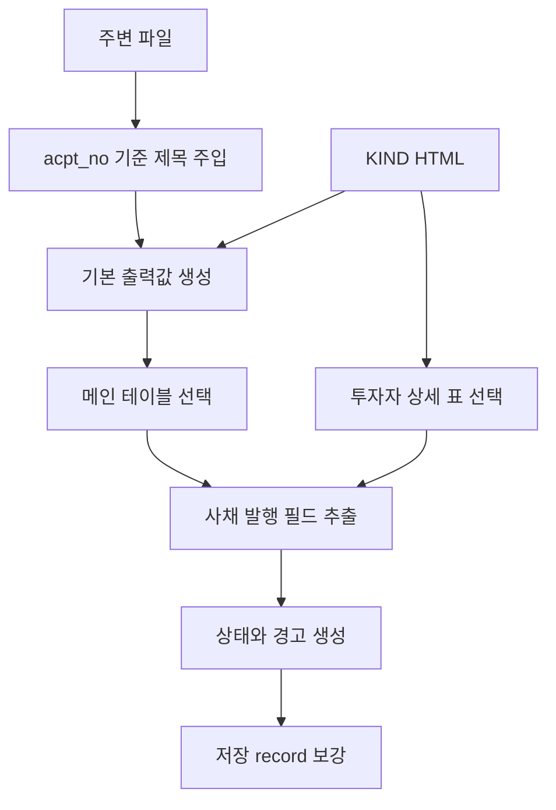

# 사채발행 파서 로직 규칙

작성일: 2026-07-06
최종 업데이트: 2026-07-09

공통 KIND HTML 파서 계약은
[HTML 파서 공통 로직 규칙](./common-html-parser-logic-rules.md)을 따른다.

## 한눈에 보기

| 질문 | 답 |
| --- | --- |
| mode | `bond_issuance` |
| 저장 파일 | `parsed-bond_issuance.json` |
| 핵심 입력 | KIND HTML, 주변 `filtered.json`/`compressed-external-html.json` 제목 |
| 핵심 판정 | 제목에서 `신주인수권부사채`, `교환사채`, `전환사채` 문구를 `BW`, `EB`, `CB` 순서로 판정 |
| 핵심 표 | `사채의 종류`, `사채의 권면`, `자금조달의 목적`이 모두 있는 첫 번째 표 |
| 상세 표 | 첫 logical row에 `발행 대상자명`과 `발행권면`이 있는 투자자 표 |
| 출력 구조 | 전환사채/교환사채/신주인수권부사채 모두 같은 최상위 필드 구조 |

## 공통 규칙 override

| 공통 항목 | 사채발행 규칙 |
| --- | --- |
| `mode` | `bond_issuance` |
| `title` 원천 | 주입 제목만 사용한다. 주입 제목이 없으면 빈 문자열과 `strong_warning`을 남긴다. |
| 판정용 제목 | `종류` 판정은 주입 제목 기준. 본문 종류값은 쓰지 않음 |
| HTML 본문 제목 | 출력 `title`이나 `종류` 판정에 쓰지 않음 |
| 원문 행 사용 | 전체 행이 아니라 `raw_tables`에서 고른 메인 테이블 행 기준 |
| 추가 상태 코드 | 없음. 공통 상태 코드만 사용 |
| `medium_warning` | 만들지 않음 |

## 처리 흐름

| 단계 | 규칙 |
| --- | --- |
| 1 | 접수번호, 원본 테이블이 들어간 기본 출력값을 만든다. |
| 2 | 기본 출력값의 제목을 주입 제목으로 고정한다. 주입 제목이 없으면 빈 문자열과 `strong_warning`을 남긴다. |
| 3 | 메인 테이블과 투자자 상세 표에서 사채 발행 필드를 추출한다. |
| 4 | 값을 찾지 못해도 파싱을 중단하지 않는다. |
| 5 | 값이 없는 필드는 `null`, 빈 목록, 또는 0으로 남기고 후처리에서 상태를 기록한다. |
| 6 | 주변 파일이 있으면 공시 회사명, 상장구분, `doc_no`, 정정공시 묶음 정보를 보강한다. |

## 모듈 책임

| 모듈 | 책임 |
| --- | --- |
| `extractor.py` | HTML 테이블/행/라벨 기준 원천 탐색과 필드 추출. 하드코딩된 표 요소, 행 라벨, 출처 설명을 둔다. |
| `postprocess.py` | extractor가 만든 값과 원천 존재 여부로 `field_parse_status`, 경고, 검증 결과를 붙인다. |
| `__init__.py` | 기본 출력값 생성, extractor 호출, 사채 발행 필드 조립, 후처리 호출을 연결한다. |

## 출력 필드

### 저장 record

공통 저장 필드는
[저장 record 계약](./common-html-parser-logic-rules.md#저장-record-계약)을 따른다.
사채발행 parser-specific 값은 아래와 같다.

| 필드 | 값 |
| --- | --- |
| `mode` | `bond_issuance` |
| `title` | 주입 제목. 없으면 빈 문자열과 `strong_warning` |
| `corp_name` | 주변 metadata의 공시 회사명. 있으면 저장 |
| `doc_no` | 주변 metadata에서 산출되는 KIND viewer 본문 문서 선택 번호. 있으면 저장 |

### 필드별 추출 규칙

| 필드 | 읽는 위치 | 성공 상태 | 실패/0 처리 | 경고 |
| --- | --- | --- | --- | --- |
| `회차` | 메인 테이블 `사채의 종류` 행에서 `회차` 셀 오른쪽 값 | `parsed` | `source_not_found` | strong |
| `종류` | 제목의 `신주인수권부사채`, `교환사채`, `전환사채` 문구 | `parsed` | `source_not_found` | strong |
| `기업명(행사대상)` | `교환대상` 행 또는 전환/인수권 행사 대상 주식 종류 행 | `parsed` | `source_not_found` | strong |
| `발행금액` | `사채의 권면` 행. `원화기준` 행 우선, 없으면 첫 권면 행 | `parsed` | 0이면 `explicit_zero`, 원천 없으면 `source_not_found` | strong |
| `발행목적` | `자금조달의 목적` 행의 목적명과 금액 | `parsed` | 원천값이 0/대시이면 `explicit_zero`, 원천 없으면 `source_not_found` | strong |
| `행사가액` | `전환가액`, `교환가액`, `행사가액`, `행사가격` 행 | `parsed` | `source_not_found` | strong |
| `납입일` | 라벨이 정확히 `납입일`인 행의 마지막 값 | `parsed` | `source_not_found` | strong |
| `만기일` | `사채만기일` 행. 없으면 `사채만기` 행 | `parsed` | `source_not_found` | strong |
| `사채발행방법` | `사채발행방법` 행의 마지막 값 | `parsed` | `source_not_found` | strong |
| `행사시작일` | 청구/행사 기간 행의 `시작일` 값 | `parsed` | `source_not_found` | strong |
| `행사종료일` | 청구/행사 기간 행의 `종료일` 값 | `parsed` | `source_not_found` | strong |
| `투자자` | 투자자 상세 표 | `parsed` | 표 없음 `source_not_found`, 표가 비면 `explicit_zero` | 표 없음 strong |

세부 규칙:

| 항목 | 규칙 |
| --- | --- |
| `종류` 판정 순서 | `BW`, `EB`, `CB` |
| `기업명(행사대상)` 정리 | 법인 형태와 주식 종류 표현을 제거해 반환 |
| `발행금액` 0 | 원문에서 실제 0 또는 대시를 읽은 것으로 보고 0원 상태로 기록 |
| `발행목적` 0 | 금액이 0인 목적은 결과 목록에서 제외 |

## 표 추출 규칙

### 메인 테이블

| 조건 | 규칙 |
| --- | --- |
| 선택 조건 | `사채의 종류`, `사채의 권면`, `자금조달의 목적`이 모두 들어 있는 첫 번째 표 |
| 사용 범위 | 대부분의 사채 발행 필드는 이 표의 행에서 읽는다. |
| 누락 시 | 메인 테이블 누락 경고와 필드별 원천 누락 상태를 만든다. |

### 투자자 표

투자자는 특정인 대상 사채발행 표에서 대상자명과 발행권면총액을 읽는다.

| 조건 | 규칙 |
| --- | --- |
| 표 인정 | 첫 logical row에 `발행 대상자명`과 `발행권면`이 모두 있어야 한다. |
| 제외 행 | `-`, `합계`, `총계`, `계` 행 |
| 금액 열 | 첫 logical row에서 찾은 `발행권면` 열 |
| 대상자명 있음 + 금액 `-` | 대상자명을 보존하고 금액을 0으로 기록 |
| 비어 있지 않은 목록 | 금액이 0이어도 `parsed` |

| 상황 | 출력 `투자자` | 상태 | 경고 |
| --- | --- | --- | --- |
| 투자자 표를 찾지 못함 | `[]` | `source_not_found` | strong |
| 표를 찾았지만 보존할 대상자 행이 없음 | `[]` | `explicit_zero` | 없음 |
| 대상자명이 `-`인 일부 행 있음 | `-` 행 제외 후 나머지 대상자 기록 | 남은 대상자가 있으면 `parsed`, 없으면 `explicit_zero` | 없음 |
| 금액만 `-`인 일부 행 있음 | `[대상자명, 0]`, 숫자 행은 실제 금액 | `parsed` | 없음 |
| 모든 보존 대상 행의 금액이 `-` | 각 대상자를 `[대상자명, 0]`으로 기록 | `parsed` | 없음 |
| 대상자명과 금액이 있음 | `[대상자명, 발행권면총액]` 목록 | `parsed` | 없음 |

## 상태와 경고

공통 상태/경고 계약은
[상태 코드 계약](./common-html-parser-logic-rules.md#상태-코드-계약)과
[경고 출력 계약](./common-html-parser-logic-rules.md#경고-출력-계약)을 따른다.

| 항목 | 사채발행 규칙 |
| --- | --- |
| 상태 코드 | `parsed`, `explicit_zero`, `source_not_found` |
| `parse_warnings` | 메인 테이블 누락, 필드 원천 누락, 검증 실패 |
| `weak_warning` | `발행목적` 합계 또는 `투자자` 합계가 `발행금액`과 다를 때 |
| `medium_warning` | 사용하지 않음 |
| `strong_warning` | 메인 테이블이 없거나 정해진 위치에서 필드 값을 찾지 못한 경우 |

### 검증 규칙

| 검증 | 실행 조건 | 실패 조건 | warning_code |
| --- | --- | --- | --- |
| `발행목적` 합계 | 목적별 금액 목록이 있고 `발행금액`도 숫자인 경우 | 목적별 합계가 `발행금액`과 정확히 다름. 오차 허용 없음 | `bond_funding_purpose_sum_mismatch` |
| `투자자` 합계 | 투자자 목록이 있고 `발행금액`도 숫자인 경우 | 투자자별 발행권면총액 합계가 `발행금액`과 정확히 다름. 오차 허용 없음 | `bond_investor_sum_mismatch` |
