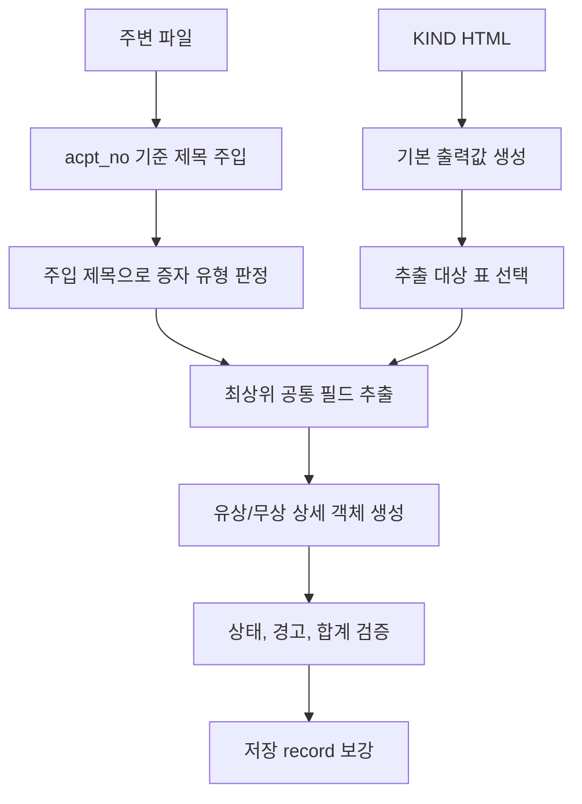

# 유무상증자 파서 로직 규칙

작성일: 2026-07-06
최종 업데이트: 2026-07-08

공통 KIND HTML 파서 계약은
[HTML 파서 공통 로직 규칙](./common-html-parser-logic-rules.md)을 따른다.

## 한눈에 보기

| 질문 | 답 |
| --- | --- |
| mode | `rights_issuance` |
| 저장 파일 | `parsed-rights_issuance.json` |
| 핵심 입력 | KIND HTML, 주변 `filtered.json`/`compressed-external-html.json` 제목 |
| 핵심 판정 | 주입 제목만으로 `유무상증자`, `무상증자`, `유상증자` 판정 |
| 추출 대상 표 | 유무상증자 본문 필드 라벨, 유상/무상 섹션 표시, 제3자배정 대상자 헤더가 있는 표 |
| 출력 구조 | 최상위 공통 필드 + 타입에 따른 `유상증자`/`무상증자` 상세 객체 |
| 특수 상태 | `not_applicable`, `source_found_empty`, `field_parse_status_detail` |

## 공통 규칙 override

| 공통 항목 | 유무상증자 규칙 |
| --- | --- |
| `mode` | `rights_issuance` |
| `title` fallback | 주입 제목이 없으면 첫 `SECTION-1` 문단, 둘 다 없으면 `<title>` 태그, 모두 없으면 빈 문자열 |
| 판정용 제목 | 증자 유형 판정은 주입 제목만 사용 |
| HTML 본문 제목 | 출력 `title` fallback에는 쓸 수 있지만 증자 유형 판정에는 쓰지 않음 |
| 원문 행 사용 | 전체 행이 아니라 `raw_tables`에서 고른 추출 대상 표의 행 기준 |
| 추가 상태 코드 | `not_applicable`, `source_found_empty` |
| 추가 출력 필드 | `field_parse_status_detail` |

## 처리 흐름

| 단계 | 규칙 |
| --- | --- |
| 1 | `filtered.json`, `compressed-external-html.json`을 읽어 `acpt_no` 기준 metadata index를 만든다. |
| 2 | 주변 파일의 제목을 parser에 주입한다. |
| 3 | parser는 주입 제목으로만 증자 유형을 정한다. |
| 4 | HTML 본문 표에서 최상위 공통 추출 필드와 상세 객체를 만든다. |
| 5 | 추출 결과에 필드별 상태, 경고 메시지, 합계 검증 결과를 붙인다. |
| 6 | 주변 파일이 있으면 회사명, 상장구분, 정정공시 묶음 정보를 보강한다. |

## 모듈 책임

| 모듈 | 책임 |
| --- | --- |
| `utils.py` | 기본 출력값 생성, 주입 제목 반영, 증자 유형 판정, 추출 대상 표 선별 |
| `extractor.py` | HTML 테이블/행/라벨 기준 원천 탐색과 필드 추출. 필드별 원천 라벨, 표 조건, 합계 검증 규칙을 둔다. |
| `models.py` | 최종 유무상증자 출력 필드 이름 정의 |
| `__init__.py` | context 생성, extractor 호출, 출력 필드 조립, 경고 병합 |

## 출력 필드

### 저장 record

공통 저장 필드는
[저장 record 계약](./common-html-parser-logic-rules.md#저장-record-계약)을 따른다.
유무상증자 parser-specific 값은 아래와 같다.

| 필드 | 값 |
| --- | --- |
| `mode` | `rights_issuance` |
| `title` | 주입 제목. 없으면 첫 `SECTION-1` 문단, 둘 다 없으면 `<title>` 태그, 모두 없으면 빈 문자열 |

### 제목과 타입 판정

증자 유형 판정은 주입 제목만 사용한다. HTML 본문 제목, `증자방식` 행, 섹션 라벨은
판정에 쓰지 않는다.

| 제목 문구 | 내부 타입 | 출력 `증자유형` | 상세 객체 | 실패/경고 |
| --- | --- | --- | --- | --- |
| `유무상증자` | `mixed` | `유무상증자` | `유상증자`, `무상증자` 모두 생성 | - |
| `무상증자` | `bonus` | `무상증자` | `무상증자` 생성, `유상증자`는 `null` | - |
| `유상증자` | `paid` | `유상증자` | `유상증자` 생성, `무상증자`는 `null` | - |
| 위 문구 없음 | `unknown` | `unknown` | 모두 `null` | strong |

타입 판정 세부 규칙:

| 항목 | 규칙 |
| --- | --- |
| 판정 순서 | `유무상증자`를 먼저 확인한다. 이 순서가 아니면 `무상증자` 문구에 먼저 걸릴 수 있다. |
| 주입 제목 없음 | 출력 `title`에 HTML 본문 제목이 남아 있어도 증자 유형은 `unknown` |
| `unknown` | 최상위 공통 필드 추출은 계속한다. |
| `mixed` 섹션 분리 | `무상증자`를 포함하고 `유무상증자`를 포함하지 않는 첫 행을 기준으로 유상/무상 섹션을 나눈다. |
| `mixed` 기준 행 없음 | 유상 섹션은 전체 추출 대상 행, 무상 섹션은 빈 목록 |

### 최상위 필드별 추출 규칙

아래 필드들은 증자 유형과 관계없이 최상위 record에 같은 이름으로 항상 출력된다.
타입과 맞지 않는 필드는 값 `"-"`와 상태 `not_applicable`로 저장하고, 원천 누락
경고와 합계 검증에서 제외한다.

| 필드 | 읽는 위치 | 타입과 맞지 않을 때 | 실패/0 처리 | 경고 |
| --- | --- | --- | --- | --- |
| `증자유형` | 주입 제목의 `유무상증자`, `무상증자`, `유상증자` 문구 | - | `unknown` | strong |
| `신주의 종류와 수` | `신주의 종류와 수` 행의 주식 종류별 정수 | - | 원천 없으면 `source_not_found`, 주식 종류별 0/대시는 detail `explicit_zero` | strong |
| `증자 전 발행주식총수` | `증자전 발행주식총수` 행의 주식 종류별 정수 | - | 원천 없으면 `source_not_found`, 주식 종류별 0/대시는 detail `explicit_zero` | strong. 보통주식 explicit zero도 strong |
| `발행목적` | `자금조달의 목적` 행의 목적명과 금액 | 무상증자이면 `"-"`/`not_applicable` | 원천 없으면 `source_not_found`, 모두 0/대시면 `explicit_zero` | strong |
| `발행가액` | `신주 발행가액` 행의 주식 종류별 정수 | 무상증자이면 `"-"`/`not_applicable` | `source_not_found` | strong |
| `증자방식` | `증자방식` 행의 마지막 값 | 무상증자이면 `"-"`/`not_applicable` | `source_not_found` | strong |
| `납입일` | `납입일` 행의 마지막 값 | 무상증자이면 `"-"`/`not_applicable` | `source_not_found` | strong |
| `신주권교부예정일` | `신주권교부예정일` 행의 마지막 값 | - | `source_not_found` | strong |
| `상장예정일` | `신주의 상장 예정일` 행의 마지막 값 | - | `source_not_found` | strong |
| `발행대상자` | 제3자배정 대상자 표 | 무상증자이면 `"-"`/`not_applicable` | 표 없음/빈 표 규칙은 아래 표 참고 | 조건부 strong |

필드 세부 규칙:

| 항목 | 규칙 |
| --- | --- |
| 주식 계열 반환 순서 | `보통주식`, `기타주식` |
| `기타주식` 표준화 | `기타주식`, `기타주`, `우선주식`, `우선주`, `종류주식`, `종류주`를 `기타주식`으로 묶는다. |
| detail 상태 | `신주의 종류와 수`, `증자 전 발행주식총수`는 `field_parse_status_detail`에 보통주식/기타주식별 상태를 기록한다. |
| 상장예정일 라벨 | `신주의 상장 예정일`은 공백을 제거해 `신주의 상장예정일`도 동일 라벨로 인식한다. |
| `발행목적` 순서 | 시설자금, 영업양수자금, 운영자금, 채무상환자금, 타법인 증권 취득자금, 기타자금 |
| `타법인유가증권취득자금` | `타법인 증권 취득자금`으로 표준화 |
| `발행목적` 0 | 금액이 0인 목적은 결과 목록에서 제외 |
| 무상증자 유상 조건 필드 | 원천 검색 결과와 관계없이 값 `"-"`와 상태 `not_applicable` |
| `증자방식` 보완 금지 | 원천이 없고 증자 유형이 무상증자여도 `무상증자`로 보완하지 않는다. |
| 상세 객체 상태 | 상세 객체 내부 필드는 별도 상태 코드를 만들지 않는다. |

### 상세 객체

| 객체 | 생성 조건 | 필드 |
| --- | --- | --- |
| `유상증자` | `paid` 또는 `mixed` | 최상위 유상 조건 필드 + `신주배정기준일`, `1주당 신주배정주식수` |
| `무상증자` | `bonus` 또는 `mixed` | 무상 섹션의 `신주의 종류와 수`, `증자 전 발행주식총수`, `신주배정기준일`, `1주당 신주배정주식수`, `신주권교부예정일`, `상장예정일` |

유무상증자에서는 최상위 `발행목적`, `발행가액`, `증자방식`, `납입일`, `발행대상자`를
유상증자 조건을 설명하는 값으로 본다. 무상증자 조건은 `무상증자` 상세 객체에서
확인한다.

## 표 추출 규칙

### 추출 대상 표

| 조건 | 규칙 |
| --- | --- |
| 선택 근거 | 유무상증자 본문 필드 라벨, 유상/무상 섹션 표시, 제3자배정 대상자 헤더 |
| 사용 범위 | 최상위 공통 필드와 유상/무상 상세 객체 필드 |
| 행 기준 | 전체 행이 아니라 선택된 표의 행 |

### 발행대상자 표

발행대상자는 제3자배정 표에서 대상자명과 배정주식수를 읽는다.

| 조건 | 규칙 |
| --- | --- |
| 무상증자 | 최상위 `발행대상자`를 `"-"`로 저장하고 `not_applicable` 기록 |
| 표 인정 | 첫 logical row에 `제3자배정 대상자`와 `배정주식수`가 모두 있어야 한다. |
| 여러 숫자 | `배정주식수` 한 셀에 숫자가 여러 개 있으면 같은 대상자의 여러 줄 수량으로 보고 합산 |
| `%` 숫자 | 배정 비율 주석으로 보고 배정주식수 합계에서 제외 |
| 후보 표 여러 개 | `신주의 종류와 수` 합계와 배정주식수 합계가 일치하는 표를 먼저 사용 |
| 제3자배정 표 없음 | `증자방식`에 `제3자배정`이 있고 제목에 `종속회사`가 없으면 strong |
| 종속회사 | 제목에 `종속회사`가 있으면 제3자배정 표 누락 경고를 만들지 않음 |

| 상황 | 출력 `발행대상자` | 상태 | 경고 |
| --- | --- | --- | --- |
| 증자 유형이 `무상증자` | `"-"` | `not_applicable` | 없음 |
| 표를 찾지 못함 | `[]` | 제3자배정 누락 경고가 나면 `source_not_found`, 아니면 상태 없음 | 조건부 strong |
| 표는 있지만 보존할 대상자 행 없음 | `[]` | `source_found_empty` | 없음 |
| 대상자명이 `-`인 일부 행 있음 | `-` 행 제외 후 나머지 `[대상자명, 배정주식수]` 기록 | `parsed` | 합계 mismatch면 weak |
| 배정주식수만 `-`인 일부 행 있음 | 해당 행 제외 후 나머지 숫자 행 기록 | 남은 대상자가 있으면 `parsed`, 없으면 `source_found_empty` | 합계 mismatch면 weak |
| 모든 대상자명이 `-`이고 배정주식수 없음 | `[["-", 0]]` | `explicit_zero` | 신주 합계와 다르면 weak |
| 대상자명과 배정주식수 있음 | `[대상자명, 배정주식수]` 목록 | `parsed` | 합계 mismatch면 weak |

`발행대상자` 표가 없고 제3자배정 누락 경고 조건에도 걸리지 않으면 현재 로직은
`field_parse_status["발행대상자"]`를 따로 만들지 않는다.

총계 행 제거 규칙:

| 조건 | 처리 |
| --- | --- |
| 마지막 행 이름 토큰 중 하나가 `계`, `합계`, `소계`, `총계` | 총계 후보 |
| 대상자 합계가 신주 합계의 2배이고 마지막 행 금액이 신주 합계 | 마지막 행 제거 |

## 상태와 경고

공통 상태/경고 계약은
[상태 코드 계약](./common-html-parser-logic-rules.md#상태-코드-계약)과
[경고 출력 계약](./common-html-parser-logic-rules.md#경고-출력-계약)을 따른다.

### 추가 상태와 출력

| 항목 | 의미 |
| --- | --- |
| `not_applicable` | 필드는 보존했지만 증자 유형과 맞지 않아 값 `"-"`로 저장했다. |
| `source_found_empty` | 표는 찾았지만 보존할 값이 없다. |
| `field_parse_status_detail` | 주식 계열 핵심 필드의 보통주식/기타주식별 상태 코드 |

### 경고 수준

| 수준 | 유무상증자 규칙 |
| --- | --- |
| weak | 값 사이의 합계/관계 검증 실패 |
| medium | `신주의 종류와 수`에서 0이 아닌 주식 종류가 둘 이상인 경우 |
| strong | 증자 유형 판정 실패, 정해진 위치의 필드 값 누락, 증자 전 보통주식 수량이 원문에서 0 또는 대시로 명시된 경우 |

### 검증 규칙

| 검증 | 실행/제외 조건 | 실패 조건 | 경고 |
| --- | --- | --- | --- |
| `not_applicable` 제외 | 값이 `"-"`이고 상태가 `not_applicable`인 필드는 합계 검증에서 제외 | - | 없음 |
| 발행대상자 합계 | `발행대상자`와 `신주의 종류와 수`가 비교 가능한 경우 | 합계가 다름 | weak |
| 발행금액 관계 | `신주의 종류와 수`와 `발행가액`, `발행목적` 합계가 비교 가능한 경우 | 곱한 값이 `발행목적` 합계와 10원 이상 다름 | weak |
| 신주 수량 0 | `신주의 종류와 수`가 명시적으로 모두 0 | 항상 mismatch로 봄 | weak |
| 증자 전 수량 0 | `증자 전 발행주식총수`가 명시적으로 모두 0 | 항상 mismatch로 봄 | weak |
| 증자 전 보통주식 0 | `증자 전 발행주식총수`의 보통주식이 명시적으로 0 또는 대시 | 항상 문제로 봄 | strong |
| 복수 주식 종류 | `신주의 종류와 수`에서 0이 아닌 주식 종류가 둘 이상 | 항상 알림 | medium |
